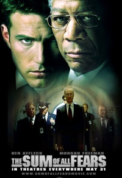

The Sum of all Fears
====================

.. articleMetaData::
   :Where: Dieren, The Netherlands

It has been a while since I updated my blog. This is not because I didn't feel
like updating, but because the simple reason that I was having my (in my opinion)
well deserved vacation. I will add a detailed travel report to my site later
this month. But now on to the more important things, the review of the holiwodization
of "The Sum of all Fears".

"SUM" is a novel by Tom Clancy, written a little over a decade ago. It's part
of the phenomenal Jack Ryan series and is settled after "The Cardinal of the 
Kremlin" and "Clear and Present Danger". The story builds on several aspects
of "CK" and these aspects are quite important in the book. Clancy's way
of describing political issues and emotions of charaters is also an important
part in his novels.

I went to the movie and expected about a one to one copy from the book, but
it became clear very quickly that I was very mistake by that. There were 
roughly four details the same as in the books, and about nothing of the
storyline. Only the basic story line was the same: A group of idiots
(Palestinians in the book, Nazis in the movie) wants to drive the USA and Russia into a nuclear war by setting
off a nuclear device. Because of distrust and misinformation, they almost
end up in that.  The movie misses a lot of the excellent building up of fear in
the minds of the American president (Fowler) and his Russian counter part
(Nemerov) and violates almost every clever thing from the book.

No, this movie was definitely not what I expected it to be, but I can not say
that it was a bad movie, it had still a nice screenplay, nice effects and
Ben Affleck was a better Ryan than I expected him to be. I'd certainly
recommend to watch this movie, but when you are a Clancy fan, you really should
forget that its based on a his book.

.. _`xdebug`: http://xdebug.org/
.. _`PHP`: http://www.php.net/

