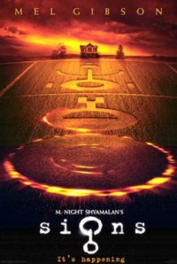

Signs
=====

.. articleMetaData::
   :Where: Dieren, The Netherlands

My travel report takes a while longer than expected, so please stay tuned.
Instead I have some other material now, a review on the movie "Signs". If
everything would have went as I'd liked, I wouldn't have seen this movie
yet. It's just because our theather didn't have "l'auberge espagnol".
Anyway, here is some funny quote from the movie:

Merrill: Morgan, this crop stuff is just about a bunch of nerds who never had
a girlfriend their lives. They're like thirty now. They make up secret codes
and analyze Greek mythology and make secret societies where other guys who
never had girlfriends can join in. They do stupid crap like this to feel
special. It's a scam. Nerds were doin' it twenty five years ago and new nerds
are doing it again.

Father Graham: Its just static, Morgan. Frequency.

[Weird noises come from the baby monitor.]

Morgan: It's a code.

Bo: Why couldn't they get girlfriends?

.. _`xdebug`: http://xdebug.org/
.. _`PHP`: http://www.php.net/

