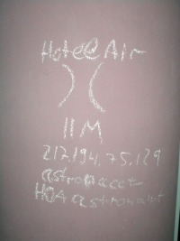

International PHP Conference 2002
=================================

.. articleMetaData::
   :Where: Frankfurt, Germany

.. image:: images/phpconf2002.jpg

Finally back from the PHP Conference in Frankfurt, Germany. The last few days
tons of people attended this years Conference to listen to sessions with PHP
related subjects and drink beer, LOTS of beer. Session topics were broad,
from `Zend Internals`_ in English to Object Oriented
Design in German. Having sessions in German is IMO not a good thing to have,
it decreases the quality of the conference for international visitors. 
Perhaps this is why there is a new conference announced; at the end of April
2003 or the beginning of May 2003 there will be held a Spring version in
Amsterdam, the Netherlands. Those folks asked me to be on the chair, so that
I can help decide which talks get accepted. I'm pretty sure all talks will
be in English, as having talks in Dutch would be plain stupid.

S&S, the organisers of the conference finally announced the birth of
a brandnew english PHP Magazine, surprisingly called "PHP Magazine". This
english cousin to the German PHP Magazin will have high quality articles on
PHP related issues and will be focussed on professional PHP users. Together
with Jan Lehnardt I'm the chief editor, so if you have proposals for
articles, or just other opinions, feel free to `mail me`_.

This year the hotel was equipped with WLAN, so that was pretty cool. What not
so cool was, was the shitty crappy login system those dudes used. You could
buy a login/password at the hotel desk for about &euro; 9 a day, but we
soon discovered that it was pretty easy to add our own accounts, those
donkeys printed the login/password for their admin interface on each printout.
Soon we had about 10 accounts registered on Rasmus's name, but he didn't even
attend this conference. This also resulted in the markings on the hotel's wall
like you can see on the right side.

All things considered, it was a pretty good conference and I would certainly
recommend to everybody working with PHP to come to the Spring edition in
Amsterdam, not only because of the quality of the sessions, but also because
of the great atmosphere that was present during this one. There were also 
rumors about free weed at the one in Amsterdam....

.. _`xdebug`: http://xdebug.org/
.. _`PHP`: http://www.php.net/
.. _`Zend Internals`: http://pres.derickrethans.nl/show.php/ze-debug
.. _`mail me`: mailto:mag@derickrethans.nl

