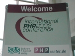

PHP Look Back
=============

.. articleMetaData::
   :Where: Dieren, The Netherlands

Hello!

We are almost at the end of 2002, and it seemed appropriate to look back on
the development issues of the past year. So starts the first PHP Look Back! If
you have any comments, feel free to post them with the link at the bottom of
this page.

There was a lot of discussion this year on several subjects, it all started
with Andi's message entitled "PHP 5" on the very first day of the year:

"The Zend Engine 2 has made lots of progress.  I think we should have a
discussion of what other things besides the scripting engine we'd like to
change for PHP 5." `[1]`_

Yes, Finally! We're heading for PHP 5!

I found it necessary to disagree with a message that said "IMHO, all extensions
should be PECL". `[2]`_ Since then I've changed my mind, as you can read in my
blog entry. `[3]`_ Our dedicated PHP troll Sir M. Lemos also had some opinions
on the future of PHP's development and of course he plugged Metabase. `[4]`_
This lovely thread had no conclusion and wasted 88 e-mails.

.. image:: images/php.gif

Two weeks later Edin Kadribasic emailed php-dev with the happy news that he
added a Command Line Interface (CLI) version of PHP which does some neat tricks
to make working with PHP as a shell scripting language much easier. `[5]`_ It
went live with PHP 4.2.0 (released on 22-Apr-2002) but not yet enabled by
default, which only happened in PHP 4.3.0 (released on 27-Dec-2002) after a
bitter fight about the naming of the CLI and CGI files. On the same day Sir M.
Lemos emailed the list again to do another plug of Metabase, totally unrelated
to the subject. `[6]`_ My comment launched the first good flamewar of the year
started, resulting in lots of nasty comments coming my way. Sterling made a
nice summary of all this. A week later, on January 18th, Andi posted a message
that he wanted to release an alpha version of Zend Engine II, which should have
been finalized by the end of Q2 in 2002. `[8]`_ As we all know, it's still not
finished :) In January we also had our first encounter with Eduardo Melo, the
computer programmer who wanted to "use a similar command of C language as such
as if (a==b && b==c)". After some private emailing, I posted a rather harsh
message to Eduardo saying that he was using the wrong list. Not surprisingly,
Manuel found it necessary to flame me for it, but other people jumped in to
kick Manuel's ass. `[9]`_ In the last week of January Joey Smith reported "On
Saturday, Jan. 26th, at 11:36am MST my son, Joseph Clark Smith, Jr. was born.
He is 19.5" in length and 7 lbs. 5 oz." and on the very last day of the month
we had another nice discussion about compiled PHP code. `[10]`_

In February we started talking about upcoming PHP 4.2.0 release, and on the
same day Zeev banned Sir M. Lemos from the php-dev mailing list, because Zeev
was sick of his bickering, and for once there was a non-stupid comment from
James about this, which tells us exactly how a lot of people felt. Too bad this
message was not public. On 11-Feb Erik was wondering if people whoe "keep
telling me PHP is a dead end, it's in fact a dying language." are just making
it up or not, but of course PHP is not dying!  On the last day of February we
created PHP_4_2 branch, but the actual release would appear in another 7 weeks.
`[12]`_ We also released PHP 4.1.2 on this day because of "a buffer overflow in
the RFC-1867 file upload code".

In March another PHP Baby was born "Buster (working name only) Lerdorf, Born
13:26 PDT Wednesday March 6, 2002, Weight: 9.0 pounds, Length: 19.25 inches".
To celebrate this wonderfull event Sascha Schumann introduced a new build
system for use in PHP 4.3 which greatly smoothed the whole build machine.
`[13]`_ "Frank from the PHP audit project" announced that the project started
started a full audit of PHP on the 4.1.2 version, which was already released a
few weeks ago. In the long term very little of this project was committed to
the PHP CVS, and most of this work was trashed. On March 12 work began on the
streams layer which was released with PHP 4.3.0. It was committed to CVS a few
days later, `[14]`_ but of course there were also some bugs that resulted in
"crashes in fflush() of libc and backtrace shows that its called by
php_stdiop_flush, which is called from php_stream_flush, php_stream_free". The
first release candidate of PHP 4.2.0 came out on March 21, after which we
decided to disable the CLI by default as it was still considered experimental.
In the last few days of March we were bickering about SIDs and generating
those, and Sterling was very happy with Sascha using a smiley in his post to
the mailing list: "OMG, sascha just used a smiley face -- REPENT! THE
APOCALYPSE IS COMING ;))))"

In April Yasuo wanted to enable mbstring by default, but got some comments
against immediately, with my mail summarizing most of the issues. `[15]`_ This
would be the last time this issue was discussed... Dan and Harmut also noticed
that the mbstring module caused annoying problems in PHP 4.2.  Anyway, at this
point it got enabled by default. The first problems with Apache 2 also showed
their face; because the Apache folks decided it to give it the "ready for
production" status, tons of PHP users thought that PHP would work flawlessly
with it, but it was certainly not true. On the 11th of April Rasmus had the
bright idea of bundling the GD library with PHP so that we no longer relied on
the Boutell folks who seemed to have lost interest in GD. Tons of fixes were
applied to our bundled library by various people. One day later Ken Egervari
found it necessary to start a useless discussion on "The PHP Platform", 88
wasted emails. On April 22nd PHP 4.2.0 was released with the biggest change
being that register_globals flag was turned off by default. A message sent on
the 27th by Theodore Brinkmann about "&lt;?php=" resulted in another useles
discussion. `[16]`_

.. image:: images/pear.gif

In May we started the PHP 4.2.1 release cycle to fix some bugs that were caused
by enabling the mbstring module by default, and of course some other annoying
things. On this same day in May I made a mention of the Xdebug extension for
debugging PHP. `[17]`_ This resulted in quite a lot of cheers by various people
but there were some comments against it. `[18]`_ With the backporting of the
DomXML extension from the HEAD branch to the PHP_4_2 branch on May 6th we were
ready to release PHP 4.2.1, which happened on the 13th. On that same day Rasmus
posted the results of a profiling run on PHP[19] but no real use could be found
for this information. On the 24th Mark Mohawk annouced the availability of
Msession Beta4, `[20]`_ a few moments later Andrei Zmieski moved the msession
extension out of php4/ext to pear/PECL because it was not a mainstream
extension; `[21]`_ this action sparked a nice discussion which resulted in the
reinstatement of the msession a few days later, even though Jani questioned
"how many real users does it have?  30'000?". 

.. image:: images/pecl.gif

A day later a small discussion was started by Zeev and he explained that "the
main problem with PECL right now is that when an extension is moved to PECL,
its author gets the feeling as if it was banished to Siberia, and that has to
be changed". `[22]`_ Luckily, a few weeks later this problem was solved. In the
last week we had a nice discussion on bundling libxml, a lots of pros and cons
were discussed in a large thread (201 messages) with the consensus being not to
bundle libxml.

For some people all those largish discussion became too much, Hans Rakkers
wondered "whatever happened to the technical level on this list". `[23]`_ I
kind of have to agree with it, there are a lot of people who think their
opinion really matters that much, which Sascha explained in a message a few
monts later "Too many people think that their opinion actually matters."
`[24]`_

In June Andrei announced `[25]`_ his site with unofficial patches `[26]`_; a
small discussion on overloading the + operator for strings followed. Andrei had
a fitting signature too "2 + 2 = 5 for extremely large values of 2.". `[27]`_
A few days later Stig announced that the PEAR installer now can install PECL
packages which brought PECL back from Siberia. Another troll on the list was
explaining that "oo != php", but he already knew we found him annoying:
"\*\*\*this will be my definitive last posting regarding this issue\*\*\*", as
he stated in his message. `[28]`_ The guru Preston L. Bannister also stated,
"Im sick of people associating oo features as java features!". Well, we're sick
of people who want everything but don't do anything. When Sascha fixed
something in the session module a week later, Yasuo wanted us to merge this
into the PHP_4_2 branch, from which PHP 4.2.2 was about to be released. Sascha
didn't think that it was important enough, and stated that "It is not like an
attacker can gain access to the server, it just makes it a bit harder for
attackers to exploit ignorant people.  That group will always be vulnerable to
social engineering, something which can only be addressed by education.
Technology is not able to upgrade your brain, after all." `[29]`_ After a fix
to the external auth mechanism by Jani a discussion ensued in which he and
Rasmus locked horns over the correctness of the fix. This discussion would
return in December, when PHP 4.3.0 was about to be released.  Later that month
we had another discussion on the locale issues with constants: in some locales
(Turkish for example) there is no lower case letter for the "I" and the
constants wouldn't work as Zend would convert the name of the constant to the
lower case.

On the first day of July some annoying twat started the "Bughunt" with the goal
of lowering the number of bogus, old, or invalid bug reports. At that moment
there were more than 800 bugreports marked as "Open". Some people grabbed a
bugpack to verify them, but it was not a great success. We didn't want to make
a ranking of bug reports closed per person because "PHP QA is much more than
boosting your ego, and if you're closing bugs because you'll end up higher in
some ranking then you're doing it for the wrong reason." `[31]`_ PHP guru
Manuel expounded on this, "Anyway, it seems that Derick that people that fix
bugs are not entitled to more recognition that they can have today, or was it
because it another idea from Manuel Lemos? Nah, Derick would never be biased
against Manuel Lemos! :-)" `[30]`_ The rest of the month was fairly quiet
because most people were on holiday. There was one interesting event which led
to the release of PHP 4.2.2: "The PHP Group has learned of a serious security
vulnerability in PHP versions 4.2.0 and 4.2.1. An intruder may be able to
execute arbitrary code with the privileges of the web server." `[32]`_ The
downloads that happened upon this release caused some severe problems with the
availability of our main website and we moved it to a different box. `[33]`_
After this release we set our sights on PHP 4.2.3, but Stig also wanted to
start on PHP 4.3.0 at the same time. It became clear later that Stig didn't
have the time to do the release, so Andrei became the Release Manager (RM) for
PHP 4.3.0.  On the last day of the month Alan Knowles, famous for his weird new
things with PHP, posted a message in which he expressed his ideas about having
threads in PHP, but the proposal did not seem viable. `[34]`_

August made a slow start, mostly because it was still holiday time. In the 2nd
part of the month Wez requested some HTTP/FTP gurus to work on the ``http://`` and
``ftp://`` wrappers and a little discussion of using cURL for this started up.
`[35]`_ Wez went along with the normal wrappers, but there are now some little
hooks for the cURL streams. A few days later Rasmus went ballistic `[36]`_
because of the "Use of trans sid may risk your users security." addition by
Yasuo in the php.ini comments for session.use_trans_sid. A few nice flames were
added, like "YOU  CAN'T RELY ON IP ADDRESSES FOR AUTHENTICATION!!!"; `[37]`_
only 84 messages were wasted on this. Thies started another discussion `[38]`_
on backporting debug_backtrace() to Zend Engine 1. Zeev and Andi didn't really
want this because it would give users fewer reasons to upgrade to Zend Engine 2
/ PHP 5. As they were about the only ones opposing, Thies committed the patch a
few days later. On the 17th Zeev expressed `[39]`_ the idea of releasing PHP
4.2.3 in a week; some QA people found it too fast, but Zeev, stubborn as ever
:), wanted to do it himself. In the next few days a lot of bugfixes were
backported from HEAD to the PHP_4_2 branch and RC1 saw life on the 22nd. With
this release Wez wrote up a plan for versions 4.3 and 5 `[40]`_ where he wanted
to "Bundle Brads php-soap extension, and "market" PHP 5 as being "Web Service
Enabled"", to which Mike Robinson replied "This will stop the "bleeding of the
PHP users...." Manuel Lemos will be pleased."

On the first day of September James Cox `[41]`_ started the discussion of not
enabling mbstring by default again and enabling as few extensions by default as
possible. Most of the core developers agreed with this, most of the Asian guys
were against because "the code is very stable. New streamable filter will not
break any thing, also." `[42]`_ and "Tell other languages developers support
multibyte strings, it's not a core feature." `[43]`_ Jani got sick of all this
bullshit and implemented '--disable-all'; `[44]`_ we still love you for this!
On the 6th PHP 4.2.3 was released. `[45]`_ On the 19th Michael Vergoz posted a
"security problem" `[46]`_ to the list, but nobody knew what it was and pointed
him to the php-general@ mailing list. `[47]`_ `[48]`_ Somehow he got pissed and
called us "quelle bande de connard" (what a bunch of assholes). `[49]`_ In the
last week Edin announced the PHP embed SAPI to allow for inclusion of PHP into
other (C) programs. `[50]`_

In October Yasuo started to bitch about implicit flush being enabled by default
for the CLI `[51]`_ `[52]`_ and his subsequent commits broke things. He got
'tried' of the issue and he really thought that "BTW, CLI is setting
implicit_flush always in it's code.  implicit_flush shouldn't be turned on
other than debugging." `[53]`_ I reverted his 'fix' and he reverted my patch
instantly. Andrei branched PHP_4_3 on the 5th `[56]`_, but on the 6th Zeev
posted a message `[57]`_ about scratching the current PHP_4_3 branch because it
was simply not stable enough and would be a mess to maintain. We agreed and
started with a few pre-releases of PHP 4.3.0.

On the 14th Mr E. Nemerson started a discussion on disabling short_open_tag by
default. `[58]`_ You could guess this, of course, but a nice war followed; lots
of popcorn was used.  After 115 message (sigh) it became clear that we didn't
want to change it.  Another 'cool' idea was offered by 'NTPT' to make it
possible to change the scope of variables. `[59]`_ Jani presented graphs
`[60]`_ that showed the number of bugs in the bug tracking system over a
month's worth of time; it was nice to to see when and how many open bugs we
had.  During the 4.3.0 release process we came up with a much better
run-tests.php script to collect reports, more additions are on the way to
collect everything in a DB and not on the mailing list. At the end of the month
Yasuo went for another round of of useless bitching about implicit_flush.
`[55]`_ To make Yasuo realize he was the only person who thought that implicit
flush should be turned off for the CLI, Zeev started a poll. `[54]`_

November started with the PHP Conference in Frankfurt `[61]`_ and Andrei
proposed to disable mbstring by default for PHP 4.3.0 `[62]`_ (yay! again).
Finally the correct decision was reached and his proposal was implemented.  We
also got some new servers and were finally be able to put up snapshots again
and Marcus Boerger wanted to "increase build time from 4 hours to 2 hours"
(whatever that may mean :). On the 18th Mattia Cazzola came up with the bright
idea of having an error handler for parse errors, and John Coggeshall became
the leader of the "Parse errors must be catchable and I want I18N error
messages" movement, which luckily was wiped off the drawing board after a very
largish discussion (692 messages). A few days later Sascha, who apparently
didn't see the big mess that localized error messages would give those who
provide support for PHP, came up with an idea for an implementation. `[63]`_

In December the release of PHP 4.3.0 was imminent, and Christoph Crottolo
`[64]`_ made a note about the naming problems with the new CLI. In 114 messages
we decided not to change the name for the CGI and make a selective installation
of both the CLI and CGI possible `[66]`_. On the 16th our French friend
Bertrand Mansion thought that we had a bug in PHP that meant that $foo:: was
not supported, but a few of the more intelligent PHP developers told him that
it was this way by design and that he had to use eval(). `[65]`_ On the 27th
PHP 4.3.0 finally saw the light of day `[67]`_ after a long and arduous release
process. In the last few days of the year Sascha started a nice little fight
with Zeev and Rasmus about quoting behavior in discussions, `[68]`_ `[69]`_
although he pushed the matter over the egde, he certainly has a point with it.

With this I want to conclude this summary of PHP in 2002; I'd like to thank
Yasuo for his stubborness, Zeev for his sense of history, all the people who
only got a CVS account to get a @php.net email address, Ilia for fixing
countless bugs, Andi for his work on Zend Engine 2, Manuel for his constructive
critisism, Stig (and others) for his work on PEAR, Jani for taking care of the
bogus bug reports, John for his comments on everything he thinks he
understands, James for 'fixing' up php.net on several occasions, Sascha for his
tour through Frankfurt's RLD and being picky about issues that matter [TM], Wez
for his work on the streams, the trolls for making fools of themselves and for
their stupid thoughts about matters they know nothing about, Levi for calling
me a Jerk, `[69]`_ Stefan for his good work on security issues, Andrei for
being the Release Master for PHP 4.3.0, and all the other people who moved
mountains with their work on PHP. It was great fun to work with you all!

At last a top 10 with the biggest discussions on PHP-dev::
	
	  576  error handling
	  211  bundling libxml2 / bundling locations
	  182  php.exe - php-cgi.exe
	  166  mbstring
	  115  short_open_tag
	  110  output buffering
	  109  aggergate vs MI
	   97  4.2.3
	   88  PHP 5
	   81  The PHP Platform

Happy new year!

Derick

.. _`PHP Magazine`: http://www.php-mag.net/
.. _`[1]`: http://news.php.net/article.php?group=php.dev&article=75506
.. _`[2]`: http://news.php.net/article.php?group=php.dev&article=75572
.. _`[3]`: http://www.derickrethans.nl/20021210.php
.. _`[4]`: http://news.php.net/article.php?group=php.dev&article=75671
.. _`[5]`: http://news.php.net/article.php?group=php.dev&article=76738
.. _`[6]`: http://news.php.net/article.php?group=php.dev&article=76763
.. _`[8]`: http://news.php.net/article.php?group=php.dev&article=77439
.. _`[9]`: http://news.php.net/article.php?group=php.dev&article=77953
.. _`[10]`: http://news.php.net/article.php?group=php.dev&article=78654
.. _`[12]`: http://news.php.net/article.php?group=php.dev&article=80469
.. _`[13]`: http://news.php.net/article.php?group=php.dev&article=80850
.. _`[14]`: http://news.php.net/article.php?group=php.dev&article=81298
.. _`[15]`: http://news.php.net/article.php?group=php.dev&article=82195
.. _`[16]`: http://news.php.net/article.php?group=php.dev&article=83341
.. _`[17]`: http://xdebug.org
.. _`[18]`: http://news.php.net/article.php?group=php.dev&article=83608
.. _`[20]`: http://news.php.net/article.php?group=php.dev&article=84403
.. _`[21]`: http://news.php.net/article.php?group=php.cvs&article=12071
.. _`[22]`: http://news.php.net/article.php?group=php.dev&article=84461
.. _`[23]`: http://news.php.net/article.php?group=php.dev&article=84846
.. _`[24]`: http://news.php.net/article.php?group=php.dev&article=92648
.. _`[25]`: http://news.php.net/article.php?group=php.dev&article=84870
.. _`[26]`: http://www.gravitonic.com/software/php/
.. _`[27]`: http://news.php.net/article.php?group=php.dev&article=84893
.. _`[28]`: http://news.php.net/article.php?group=php.dev&article=84992
.. _`[29]`: http://news.php.net/article.php?group=php.dev&article=85182
.. _`[31]`: http://news.php.net/article.php?group=php.qa&article=5572
.. _`[30]`: http://news.php.net/article.php?group=php.qa&article=5576
.. _`[32]`: http://news.php.net/article.php?group=php.dev&article=86066
.. _`[33]`: http://news.php.net/article.php?group=php.dev&article=86079
.. _`[34]`: http://news.php.net/article.php?group=php.dev&article=86362
.. _`[35]`: http://news.php.net/article.php?group=php.dev&article=86707
.. _`[36]`: http://news.php.net/article.php?group=php.dev&article=86774
.. _`[37]`: http://news.php.net/article.php?group=php.dev&article=87206
.. _`[38]`: http://news.php.net/article.php?group=php.dev&article=86911
.. _`[39]`: http://news.php.net/article.php?group=php.dev&article=86932
.. _`[40]`: http://news.php.net/article.php?group=php.dev&article=87097
.. _`[41]`: http://news.php.net/article.php?group=php.dev&article=87666
.. _`[42]`: http://news.php.net/article.php?group=php.dev&article=87733
.. _`[43]`: http://news.php.net/article.php?group=php.dev&article=87715
.. _`[44]`: http://news.php.net/article.php?group=php.dev&article=87882
.. _`[45]`: http://news.php.net/article.php?group=php.dev&article=88013
.. _`[46]`: http://news.php.net/article.php?group=php.dev&article=88434
.. _`[47]`: http://news.php.net/article.php?group=php.dev&article=88435
.. _`[48]`: http://news.php.net/article.php?group=php.dev&article=88437
.. _`[49]`: http://news.php.net/article.php?group=php.dev&article=88439
.. _`[50]`: http://news.php.net/article.php?group=php.dev&article=88728
.. _`[51]`: http://news.php.net/article.php?group=php.dev&article=88914
.. _`[52]`: http://news.php.net/article.php?group=php.dev&article=88939
.. _`[53]`: http://news.php.net/article.php?group=php.dev&article=88950
.. _`[56]`: http://news.php.net/article.php?group=php.dev&article=89053
.. _`[57]`: http://news.php.net/article.php?group=php.dev&article=89071
.. _`[58]`: http://news.php.net/article.php?group=php.dev&article=89446
.. _`[59]`: http://news.php.net/article.php?group=php.dev&article=89779
.. _`[60]`: http://www.php.net/~jani/bugs-graph.php
.. _`[55]`: http://news.php.net/article.php?group=php.dev&article=89955
.. _`[54]`: http://marc.theaimsgroup.com/?l=php-dev&m=103577150916355&w=2
.. _`[61]`: http://www.php-conference.de/gallery/
.. _`[62]`: http://news.php.net/article.php?group=php.dev&article=90611
.. _`[63]`: http://news.php.net/article.php?group=php.dev&article=91720
.. _`[64]`: http://news.php.net/article.php?group=php.dev&article=92194
.. _`[66]`: http://news.php.net/article.php?group=php.dev&article=92682
.. _`[65]`: http://news.php.net/article.php?group=php.dev&article=92570
.. _`[67]`: http://www.php.net/ChangeLog-4.php
.. _`[68]`: http://news.php.net/article.php?group=php.dev&article=92908
.. _`[69]`: http://news.php.net/article.php?group=php.dev&article=92850

