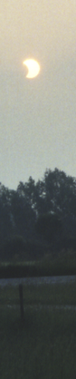
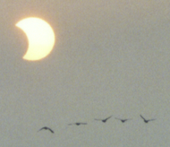

Solar Eclipse
=============

.. articleMetaData::
   :Where: Dieren, The Netherlands

Only two weeks after the `Lunar eclipse on May 16th`_ we had another eclipse, a
partial `annular solar eclipse`_. Because much of the theory is the same as
last time we're going to skip that.

The `path`_ of the eclipse made it so that the eclipse would be total just
before sunrise so we would see the sun rise in a 'weird' way. Sun rise happened
at 5:29am today so I had to get up early in order to witness this event.  When
I drove to my spot I saw that I wasn't the only person waking up to see the
event, and I ended up watching with about 15 other people.

In the first ten minutes there was nothing to see, until 5:41 where we finally
spotted the sun. I started taking pictures every 30 to 60 seconds in order to
make a nice composition photo of the progress of the eclipse. All images are
taken with a Minolta 404 camera on a Fujicolor 200 film, F=5.6 and the shutter
speed varies from 1/60th ( `first photo in the series, taken at 5:41:15am`_) to
1/250th ( `last photo in the series, taken at 6:06:45am`_). The best photos are
placed here, all other pictures can be found `here`_.

Disclaimer: Diagrams linked are © `Fred Espenaks`_ page. Photos are © by
`Derick Rethans`_ and can not be used in print or electronic publishing without
written permission.

.. _`International PHP Magazine`: http://www.php-mag.net/
.. _`Xdebug`: http://xdebug.org/
.. _`PHP`: http://www.php.net/
.. _`Lunar eclipse on May 16th`: /20030523.php
.. _`annular solar eclipse`: http://sunearth.gsfc.nasa.gov/eclipse/ASE2003/ASE2003.html
.. _`path`: rst/images/ASE2003-3b.GIF
.. _`first photo in the series, taken at 5:41:15am`: http://photos.derickrethans.nl/solar2003/aaa?full=1
.. _`last photo in the series, taken at 6:06:45am`: http://photos.derickrethans.nl/solar2003/abf?full=1
.. _`here`: http://photos.derickrethans.nl/solar2003
.. _`Fred Espenaks`: http://sunearth.gsfc.nasa.gov/eclipse/ASE2003/ASE2003.html
.. _`Derick Rethans`: /who.php

