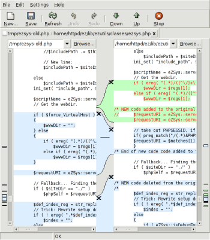

Toolkit: Meld
=============

.. articleMetaData::
   :Where: Dieren, The Netherlands

For my `work`_ I needed to merge differences between two files into a new file
and doing this by just watching output from 'diff' is a little bit too annoying
to do. I remembered somebody recommending `Meld`_ too me. It shows the
differences in a clear graphical way and also allows you to edit the text in
the files, which is ideal for a scripting language like PHP. It saved me a lot
of problems merging the changes, the only 'problem' is that it doesn't
integrate with `Subversion`_ the version control system we use for `eZ
Publish`_.

Here is also a screenshot of Meld in action:

.. _`work`: http://ez.no
.. _`Meld`: http://meld.sourceforge.net/
.. _`Subversion`: http://subversion.tigris.org/
.. _`eZ Publish`: http://pubsvn.ez.no/

