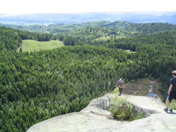

Blåfjell
========

.. articleMetaData::
   :Where: Skien, Norway
   :Date: 20040607 2358 CEST
   :Tags: nature

After the `summer conference`_ Gunnstein, Gurudutt, Jan, Vera and I were not yet tired enough and
decided to climb a nearby mountain, Blåfjell (Blue Mountain).
Although the way up was tiresome the summit gave a terrific view.

.. _`summer conference`: http://ez.no/

