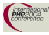

Conference Time
===============

.. articleMetaData::
   :Where: Skien, Norway
   :Date: 20040804 0837 CEST
   :Tags: work, php

In the fall I will be touring around to talk at several
conferences. Those include `php|works`_ in Toronto
where I will be speaking on `Xdebug`_ and Multi-lingual
development,

the `International PHP Conference 2004`_ in Frankfurt where I will be speaking on
"Migrating from PHP 4 to PHP 5" and `Enterprise PHP Bananas`_ and

Forum PHP Paris (hosted by the `AFUP`_ ),
where I'll speak on `Xdebug`_

.. _`php|works`: http://www.phparch.com/phpworks/
.. _`Xdebug`: http://xdebug.org
.. _`International PHP Conference 2004`: http://www.phpconference.com/2004/index_en.php
.. _`Enterprise PHP Bananas`: http://derickrethans.nl/projects.html#srm
.. _`AFUP`: http://afup.org/

