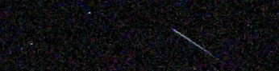

Meteors are too fast
====================

.. articleMetaData::
   :Where: Langesund, Norway
   :Date: 20040812 0315 CEST
   :Tags: nature

With the yearly Perseïdes swarm shooting stars at us I went to try
to photograph those fast shooting dust particles. This is not an
very easy task as they appear random in the sky and are very fast.
Together with Bård we headed to the most southern tip of Langesund
a bit after midnight and started looking at the sky. There were
quite a lot of shooting stars, about one a minute, but I only
managed to catch one on (digital) film.

I also tried to make a few analog pictures of the Pleiades, but it
will take some time before those are developed.

