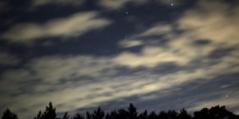
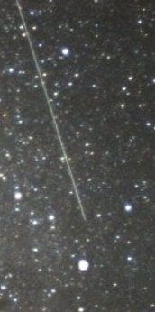
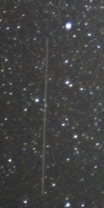
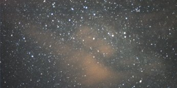
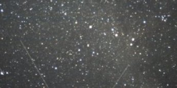
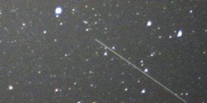
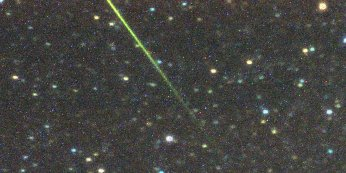
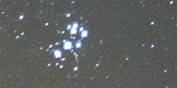

Perseïds Report
===============

.. articleMetaData::
   :Where: Langesund, Norway

All the pictures are collected of our first attempts at photographing meteors.
Unfortunately all of my analog pictures (on the 200 ISO film) turned out to be
black, except for the two showing the Pleiades.  Unfortunately I can not show
them as the photoshop here didn't print them. I doubt that they would show more
than seven dots though. But there is still hope as during the second night I
made three pictures of the Pleiades with an 800 ISO film, and also three more
of Alchor and Mizar. It will take a lot of time before I see those prints
though as I still have 30 pictures left on this film. But now on to the
pictures, which were all made by Bård.

The sky just after sunset

Two possible meteors, but they could be just as well
satellites.

Light clouds among the stars.

Two faint satellites.

A nice suspected meteor.

A very bright yellow Perseïd.

A shot of the Pleiades, you can clearly count the "seven
sisters".

All pictures are taken with a Nikon D100, set to 500 ASA and with a
50mm lens and an Aperture of 1.6. Without Paul B.'s tips we wouldn't
have been able to make those shots though, so our thanks go out to
him. Probably we will do more photoshoots of other "stars" during the
winter when it get's much darker here than in the end of summer.

