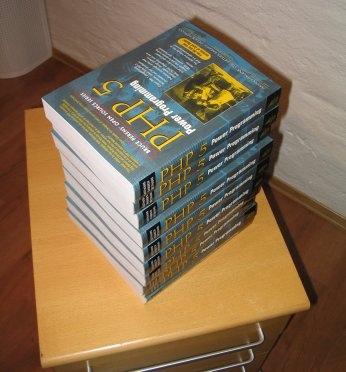

PHP 5 Power Programming
=======================

.. articleMetaData::
   :Where: Skien, Norway

Finally the book is out, after about a year of hard work writing, and a couple
of months revision the manuscript `PHP 5 Power Programming`_ is finally
available for purchase.

The book — written by Andi Gutmans, Stig Sæther Bakken and myself — covers all
the new features and functionality in PHP 5, but also introduces PHP for people
with experience in HTML or a different programming language.

The first chapter gives a quick overview of the new features in PHP 5, most of
them related to the new object model. In the chapters two to four PHP's syntax,
OO syntax and advanced OO design such as patterns are covered. Chapter five
introduce the art of writing a web application with PHP, and ofcourse deals
with the different security issues that programmers should be aware of while
creating a web application.

Chapter six covers the new MySQLi extension for talking to `MySQL`_ and
`SQLite`_ extension and chapter seven continues with handling errors. In
chapter eight all the new possibilities with PHP 5's XML extensions are on
display and chapter eight talks about five other important aspects: handling
files and streams, Perl Regular Expressions, handling dates and times, graphic
manipulation with GD and internationalization issues.

Chapters ten to twelve cover `PEAR`_, important PEAR packages and building PEAR
components, whereas chapter thirteen explains the changes between PHP 4 and PHP
5 that need to be taken into account when migrating to the latest and greatest.
In Chapter fourteen several performance tips and profiling techniques are
addressed, chapter fifteen introduces the art of writing basic PHP extensions
and the last chapter, chapter 16, covers PHP's command line interface.

Three appendixes come with the book. Appendix A contains a PEAR Package Index
to have an easy overview of the power of what PEAR has to offer, Appendix B
contains a reference guide to `phpDocumentor`_ and Appendix C contains the Zend
Studio Quickstart accompanying the 90 day trail of Zend Studio.

As you can read the book has a lot to offer and feel free to post comments or
report errors at the `forum`_.

`PHP 5 Power Programming`_

::
	
	ISBN: 013147149X
	Published: Oct 27, 2004
	Copyright 2005;
	Dimensions 7x9-1/4
	Pages: 720

.. _`PHP 5 Power Programming`: http://www.amazon.co.uk/exec/obidos/ASIN/013147149X/derickrethans-21
.. _`MySQL`: http://mysql.com
.. _`SQLite`: http://www.sqlite.org/
.. _`PEAR`: http://pear.php.net
.. _`phpDocumentor`: http://phpdoc.org
.. _`forum`: http://php5powerprogramming.com/questions

