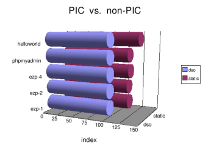

PIC vs. non-PIC, take #2
========================

.. articleMetaData::
   :Where: Skien, Norway
   :Date: 20041210 1411 CET
   :Tags: php, work, cms

After mentioning George's URL to Rasmus, he mentioned that George's
blog is full of spam and that I should do those test myself
rather. So I did (Not because Rasmsus said it, but because I only
believe what I see myself ;-) The results did definitely show that
a statically compile PHP module is faster than a DSO module,
though it heavily depends on the script on how much it matters. I
tested three different applications, a Hello World script (which
doesn't print "Hello World", the homepage of a phpMyAdmin
installation and three different configurations of `eZ publish`_ .

The "Hello World" application shows the largest performance
increase, likely because it is pure PHP code only. `The script`_ ran 28%
percent faster, and the raw data for this test is `here`_ .

Both phpMyAdmin and `eZ publish`_ show an
increase of little more than 10%, which is not the 30% that was
mentioned before, but definitely a worthwhile increase, and it
simply comes by running PHP as a static (or non-PIC) module in
Apache. Now let's hope that Joe can commit `his patch`_ soon. Raw results are available too, for `phpMyAdmin`_ and `eZ publish`_ .

.. _`eZ publish`: /files/ezpublish.bm.txt
.. _`The script`: /files/benchmark.php.txt
.. _`here`: /files/helloworld.bm.txt
.. _`his patch`: http://marc.theaimsgroup.com/?l=php-dev&m=109534492215476&w=2
.. _`phpMyAdmin`: /files/phpmyadmin.bm.txt

