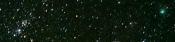
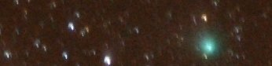

Machholtz
=========

.. articleMetaData::
   :Where: Langesund, Norway
   :Date: 20050209 1959 CET
   :Tags: photography

Two photos of the comet Machholtz, which I took about a week ago. At the moment the weather is too bad to
take more pictures unfortunately. The first one shows the open star cluster in Perseus, and the second on a
closer look at the comet.

