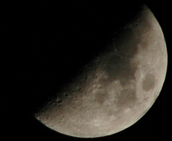

Half a Moon
===========

.. articleMetaData::
   :Where: Skien, Norway
   :Date: 20050215 2320 CET
   :Tags: photography

With a borrowed 300mm lens I just made this image of the moon (not scaled, just cropped). 300mm focal
length, f=5.6 aperture and 1/400s exposure.

