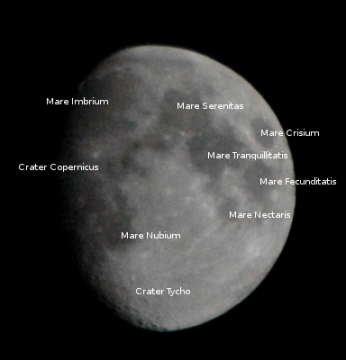
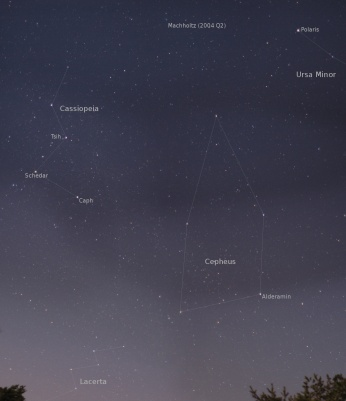

Constellations
==============

.. articleMetaData::
   :Where: Langesund, Norway
   :Date: 20050223 1941 CET
   :Tags: photography

During the weekend I made another trip to the coast near Langesund. Although the Moon was pretty bright, I did make some panoramic
photos of the skies.

The image above is the largest panorama that I made, and it covers most of the sky when looking North. Even
the `comet Machholtz`_ is visible again. All 12 images of the panorama where
shot with f=1.2 and a shutter speed of 4s on 400 ASA.

.. _`comet Machholtz`: /machholtz.php

