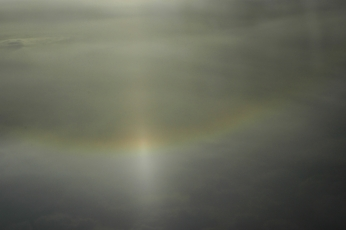

22° Halo
========

.. articleMetaData::
   :Where: Manchester, UK
   :Date: 20050306 0106 CET
   :Tags: photography

When flying into Manchester Airport `last week`_ on my way to
the Sheffield LUG Seminar I noticed a rainbow coloured circle (actually, only a part of a circle) around the
sun. I think it's part of a `22° circular halo`_ although I'm not sure. You can clearly see that it's darker inside the "circle". What is also
unknown is why there is this bright white ray directly between the Sun and the Earth (the image is a bit
rotated, so that's why it's not straight down).

.. _`last week`: /fosdem_and_sheflug_slides.php
.. _`22° circular halo`: http://www.sundog.clara.co.uk/halo/circular.htm

