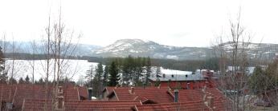
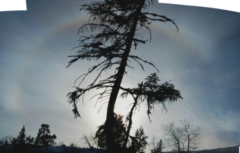
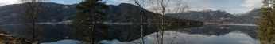

Skiing in Vrådal
================

.. articleMetaData::
   :Where: Vrådal, Norway
   :Date: 20050327 0934 CEST
   :Tags: photography, holiday

Norwegians usually spend their long easter holiday in the Mountains in some cabin, and so did I this year.
Together with Frederik, Ray and Judith we went skiing in Vrådal. Although the skiing area is not very large,
we had a wonderful time and really excellent weather.

This 22° Halo I first spotted when going up with the elevator to the mountain's summit again - I've been
looking for this during the whole trip as I guessed that `conditions`_ would be perfect for it.

We also had amazingly nice scenery on our way back. The image above is a mozaic of 15 images from a lake
near Seljord. The rest of the trip's images are `here`_ .

.. _`conditions`: http://www.sundog.clara.co.uk/halo/circ1.htm
.. _`here`: http://photos.derickrethans.nl/vraadal

