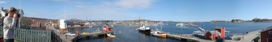

Photo Trip to Mølen
===================

.. articleMetaData::
   :Where: Helgeroa, Norway
   :Date: 20050417 1953 CEST
   :Tags: photography

.. image:: images/koelen.jpg
   :align: center
   :target: http://photos.derickrethans.nl/2005norway-moelen/abl

Spring seems to have started here - nice temperature and sunny. I also
wanted to play with a new lens that I bought, a f=2.8 28mm Nikkor lens -
this time also Auto-Focus. Together with Kristian and Łukasz we drove
to Helgeroa over the old E18 to Mølen, a "famous" beach full
with stones.

After visiting the beach we continued along the coast and ended up in
Stavern to sit besides the Brygge and have an icecream in the sun.

