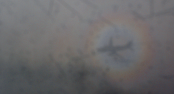

Plane Glory
===========

.. articleMetaData::
   :Where: Sofia, Bulgaria
   :Date: 20050428 2355 CEST
   :Tags: photography, travel

When flying back from `WebTech`_ in Sofia last Sunday I noticed a halo around the shadow of my plane on
the clouds. This effect is called `a glory`_ .

.. _`WebTech`: http://webtech2005.info
.. _`a glory`: http://www.sundog.clara.co.uk/droplets/glory.htm

