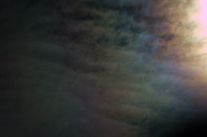
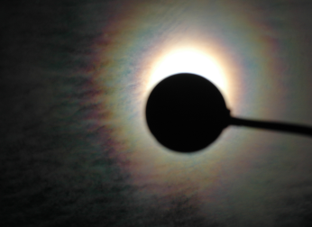

Colours in the sky
==================

.. articleMetaData::
   :Where: Skien, Norway
   :Date: 20050528 0020 CEST
   :Tags: nature, photography

When I was walking home from work today I spotted some colours in a
cloud near the Sun. When I got home I decided to make some pictures of
it, and it turned out to be much better on (digital) film. These
coloured bands around the Sun (or Moon) are called `coronae`_ and form due to light diffraction by tiny particles such as water
droplets. I have some more pictures `here`_ .

.. _`coronae`: http://www.sundog.clara.co.uk/droplets/corona.htm
.. _`here`: http://photos.derickrethans.nl/asmosphere

