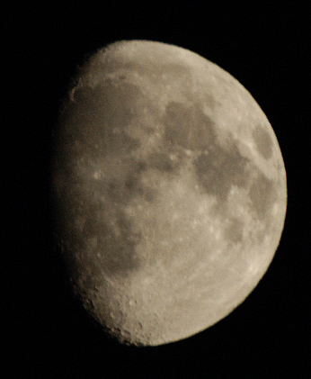

More Moon pictures
==================

.. articleMetaData::
   :Where: Skien, Norway
   :Date: 20050618 0119 CEST
   :Tags: nature, photography

I finally managed to make some moderately sharp image of the Moon with
the borrowed 300mm lens. This image was taken June 18, 21:36 GMT with
f/7.1 and a shutterspeed of 1/200s.

