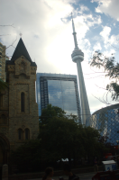
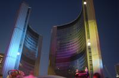

Frequently Flying
=================

.. articleMetaData::
   :Where: Toronto, Canada
   :Date: 20050925 2039 CEST
   :Tags: cms, conference, php, travel, work

During
the last week I was attending `php|works`_ in Toronto. I could
finally make use of my earned frequent flyer miles, by pre-boarding the
plane with all the children and disabled people. The flights to Toronto
were all quite okay.

The conference itself was a good experience, with my talk with the title
" `The PHP Toolbox`_ " I
explained the whole process of the development of the `eZ`_ publish Components, providing the audience
with ideas on how to setup, plan and execute a Components Library. In
the evening Marco took us to " `The Great Kahn`_ ", a Mongolian Grill restaurant.

After my two talks on "PHP 6 and Unicode" and "How PHP
Ticks" on friday the conference came to its end. Dan and Ilia took
a couple of us on a trip through Toronto's downtown for dinner, and
drinks. Toronto has plenty of `interesting bars and restaurants`_ , anf ofcourse we only went to a couple of
them.

On
Saturday Lukas and I were acting like tourist by first going to the `CN Tower`_ and
then walking trough the city center. At some point we ended up at City
Hall square where some sort of `performance`_ was going on. We quickly noticed that this was only a repetition and
that the real thing would start at 8:30pm. So we went for dinner and
returned a couple of hours later. The show was "Of Angels and
Light" by an Italian group called " `Studio Festi`_ ". It was
a quite an `impressive show`_ to celebrate `Toronto City Hall's 40th anniversary`_ .

Slides of all the talks can as usual be found on my `Talks`_ page.

.. _`php|works`: http://phparch.com/works
.. _`The PHP Toolbox`: /files/toolbox.pdf
.. _`eZ`: http://ez.no
.. _`The Great Kahn`: http://www.mongoliangrill-gk.com/index.htm
.. _`interesting bars and restaurants`: http://photos.derickrethans.nl/phpworks05?page=2
.. _`CN Tower`: http://photos.derickrethans.nl/phpworks05/abj
.. _`performance`: http://photos.derickrethans.nl/phpworks05/abq
.. _`Studio Festi`: http://www.studiofesti.com/eng/
.. _`impressive show`: http://photos.derickrethans.nl/phpworks05?page=6
.. _`Toronto City Hall's 40th anniversary`: http://www.toronto.ca/special_events/anniversary/
.. _`Talks`: /talks.php

