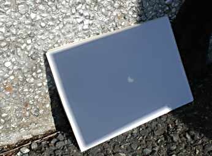

Partial Solar Eclipse 3 October 2005
====================================

.. articleMetaData::
   :Where: Skien, Norway
   :Date: 20051004 1037 CEST
   :Tags: nature, photography

Today we had `annular solar eclipse`_ which was unfortunately not visible from my
location. Here we had a simple partial eclipse. As it is way to
dangerous to look directly into the sun to see it, I used a cardboard
square with a hole in it to project the sun's eclipsed disc on a
projection screen mode out of white paper.

.. _`annular solar eclipse`: http://sunearth.gsfc.nasa.gov/eclipse/SEmono/ASE2005/ASE2005.html

