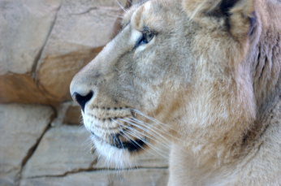
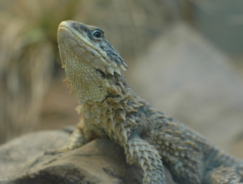
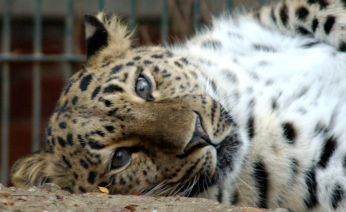

Frankfurt Zoo
=============

.. articleMetaData::
   :Where: Frankfurt, Germany
   :Date: 20051120 1953 CET
   :Tags: conference, nature, photography, php, travel

During the conference in `Frankfurt`_ I visited the local
Zoo with `Ilia`_ and `Sebastian`_ to take some
pictures.

Unfortunately most of the animals were inside, and it's quite hard to
take pictures through think glass. But atleast you can get really close
up pictures without your head getting torn off.

This shows really well what an aperture of 1.2 does - you can see that
only a very small amount is in the focus area here.

Outside we found two leopards, one was constantly moving, but this one
was quietly laying and watching around.

The rest of the pictures from the Zoo are in my `gallery`_ .

.. _`Frankfurt`: /frankfurt_conference.php
.. _`Ilia`: http://ilia.ws
.. _`Sebastian`: http://sebastian-bergmann.de
.. _`gallery`: http://photos.derickrethans.nl/animals

