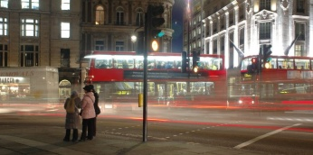

London Conference
=================

.. articleMetaData::
   :Where: London, UK
   :Date: 20060215 1021 CET
   :Tags: cms, conference, php, travel, work

Last Friday I spoke at the `PHP UK Conference`_ in London on the `eZ components`_ .
(Presentation slides as as usual on the `talks`_ page). I enjoyed this conference, which
was organized by the `PHP London User Group`_ . This was their first conference, and the organizers
did an excellent job. I always enjoy going to a conference for users
(as opposed to business conferences) so much more.

Harry Fuecks had an interesting session on `Ajax and Latency`_ where he describes that Ajax frameworks need to come
a long way before they are really usable. I can not agree more with the
points that he made.

In case you are interested in hearing about the eZ components and you
missed my talk in London, I will be giving a similar presentation
through `php|architect`_ by means of
a webcast next Friday. This is a free webcast for which you can sign up `here`_ .

Of course a trip by me never goes without taking pictures, you can find
them in my `gallery`_ .

.. _`PHP UK Conference`: http://phpconference.co.uk
.. _`eZ components`: http://ez.no/products/ez_components
.. _`talks`: /talks.php
.. _`PHP London User Group`: http://www.phplondon.org/
.. _`Ajax and Latency`: http://www.sitepoint.com/blogs/2006/02/10/ajaxlocalhost/
.. _`php|architect`: http://phparch.com
.. _`here`: http://phparch.com/shop_product.php?itemid=108
.. _`gallery`: http://photos.derickrethans.nl/phpconfuk6

