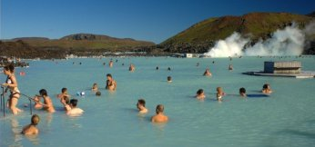
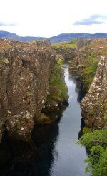
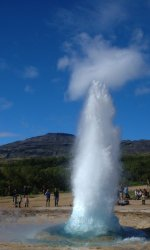
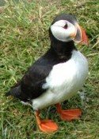
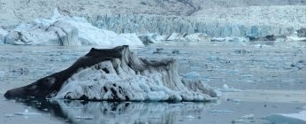
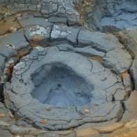
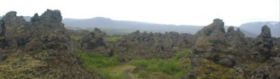
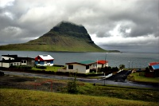
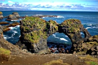

Iceland - Fire and Water
========================

.. articleMetaData::
   :Where: Reykjavik, Iceland
   :Date: 20060718 1509 GMT
   :Tags: holiday, nature, photography

Most people don't mention "Iceland" as their top number one
holiday destination. However I'm a bit strange and decided to go to
just this place on holiday this year. After some investigations it
seemed that the best time of year was somewhere around the end of July
regarding temparature, however you never know certain about what to
expect. That means packing *all* types of clothes... summer
clothes, but also a thick winter jacket, skiing clothes and rain
clothes. Of course, depending on what you are going to do exactly. I
wanted to see all possible types of terrain on iceland, which includes
nice warm lagoons (swim wear) and glacier (warm clothes is a good idea
there). Flights to Iceland are not very cheap either, but then again,
nor is anything else cheap on Iceland. (Yes, the alcohol tax is even
higher than in Norway). After a bit of investigation in the different
points-of-interest on Iceland with the help of some locals (thanks
Helgi and Bjori!) and the Lonely Planet I headed to Iceland with a
friend on July 6th.

*101 Reykjavik*

After getting to Keflavik airport way to late at night we managed to
find our way to the guesthouse just to find that I fluked the
reservation and they they expected us to arrive the next day. That
meant that we had to sleep in "sleeping bag accomodations"
which was not so confortable but I really didn't care after this overly
long trip. A guesthouse is normally just a small step down from a hotel
usually without people cleaning up your room every day. It does however
provide a good and somewhat cheaper place to stay at.

The next day we toured around Reykjavik and the Reykjanes peninsula a
bit and basically just waited until our room at the guest house was
ready. After a well needed shower to get rid of all the smells we met
up with a local and headed for a relaxing bath in the Blue Lagoon, the
most famous (but definitely not the only) geothermal pool in Iceland.
Helgi suggested to have dinner at ... and so we went there for a good
meal. The best meat in Iceland is sheep or lamb and you figure out why
once you start out driving in the country side... the only animal that
you'd find there is sheep... and you find them literally everywhere -
both off the road and on the roads.

*Þingvellír (Thingvellir)*

Iceland begun quite some time ago with the first parliament ever in
930. The parliament was build on a site called Þingvellír which is
now part of a national park. Besides the site of the former parliament
the general landscape is also quite interesting as well as there is a
massive lava ridge cutting across the landscape there as well as some
water filled gorges and (ofcourse) a waterfall. From Þingvellír we
avoided the ring road on the way back to Reykjavik and instead took
some road closer to the south of the country. Little did we know as
suddendly the road turned into a gravel road which we had to follow for
the next, say, 50 kilometers. The road did however pass an interesting
site with lots of water coming up from the ground in bright coloured
mud pools.

*Water*

As proper tourists we visited two other popular sites the next day.
Starting off on the southern ring road we left busy Reykjavik to visit
"Geysir".

Before we ended up at the geysirs we drove past the Keriđ explosion
crater. We actually tried to have a look at this one the day before but
our map had it in a totally wrong place, however my GPS map (!! add
link) did have it correctly. (!! add stuff about this event). All that
as left now is a crater which now houses a small lake in the middle.

The
English word geysir finds its origin in exactly the site which formerly
housed this great natural water fountain in Iceland. However, in the
last few years the original geysir does no longer function properly and
only rarely spits out its water into the air. However at the same site
there is another geysir called Strokkur which still performs well.
About every 5 to 10 minutes it bursts out water into the air, however
each bursts intensity varies quite a bit. You need to be a bit lucky to
see a "big one". Besides Strokkur there are also a number of
smaller less regular geysirs and "Bluesi" - a very blue pool
with warm water.

From the geysir field we then proceeded towards Gullfoss - the Golden
Falls - named because its always present rainbow. However... if there
is no sun there won't be a rainbow either ofcourse. We were lucky and
the weather was fair so we could enjoy the magic of the great falls.

*Past the great glacier*

Leaving Reykjavik behind we set off for Höfn (pronounced like
"Hùb"). Along this route there are many smaller and larger
waterfalls including one of Iceland's finest called
"Seljalandsfoss". We went to see a few of those and then
wandered off the ring road to have a look at the Dyrhólaey plateau
where there is a large colony of puffins as well. We spend some time
trying to get as close to the puffins as possible for a good photo and
then proceeded our route to Höfn. When driving along the southern ring
road we passed lots of lava fields and glacier tongues. The glacier
toungues are all part of the largest icecap of Europe: Vatnajökull.

About an hour before Höfn we passed the Jökulsárlón bay which is
filled with icebergs from the Breiđamerkurjökull glacier. This bay
gives a very strange feeling as it looks like it just comes out of a
movie. Coincidentally we figured out later that parts of a James Bond
film (Die Another Day) was shot here on this bay. Höfn itself is a
tiny tiny town with little to do, however we would only use it as base
camp for our glacier expedition.

*Hike on Svínafellsjökull glacier*

The next morning we left early from Höfn to be on time for our 10
o'clock appointment with the Icelandic Mountain Guides. This little
plan of ours almost went wrong because at the Jökulsárlón bay they
where working on the bridge which set us back by about 20 minutes. We
barely made it on time to the base camp of the mountain guides just to
find that they had us down for 14:00 and not 10:00. Luckily there was
still some space for us in the 10:00 tour. There was not much Icelandic
about our guide as he was there on an exchange project from New Zealand:
Ben. Ben took us out on a trip over the lower parts of the
Svínafellsjökull glacier and explained us about the different things
that make up a glacier. Basically a glacier is just compressed snow but
because of gravity this compressed mass starts moving down the valleys
until there is a point where the sun is winning from the accumulation
of snow. Here the glacier melts and ends. Between the main icecap
Vatnajökull and the edge are the glacier valleys and ice falls. Just
after we came off the glacier it started to pour so we just drove back
to Höfn and stayed in. I managed to assemble most of my panoramas and
manage all my photos that I'd taken so far.

*From Höfn to Akureyri*

Rain, rain and more rain was the case this day as well when we passed
past numerous bays and inlets on the eastern side of Iceland and later
through high plains with lava fields. Somewhat closer to Myvatn we made
a small detour to see the Krafla region's vulcanic activity but bad wind
and rain killed that plan. We did manage to have a look at the Krafla
power station where electricity is won from earth heated water in the
form of steam. The small tour of the plant was done by a girl who've
had this summer job for the past 4 years and was happy to answer our
questions, especially because were not so loud as the three tour busses
that left when we just got there I suppose. We promised to come back to
the Krafla area to see more of it the next day as weather was supposed
to improve a lot.

*Waterfalls and Vulcanoes*

And indeed the weather did improve. With 18°C and sunny it was the
perfect day to investigate some of the waterfalls in the area and then
head back to the Krafla region. First on the menu was Gođafoss, which
is situated very close to the ring road itself. From there on we went
to the Ásbyrgi canyon on the north side of the road that leads to
Dettifoss. The road that leads to Dettifoss is a 25 km long gravel road
(doesn't matter from which end) that goes over some very intersting
landscape which can only be similar to something as remote as the moon.
There are actually multiple waterfalls in this river and you can get
close to three without too much walking. The first one is
Hafragillsfoss, which is rather uninspiring as you can see Dettifoss'
spray in the background already. Dettifoss is actually quite ugly with
black water but it is the most powerful waterfall in Iceland so you
shouldn't really miss it.

From
the same carpark that serves Dettifoss it's a nice 1.5 km hike to the
third waterfall that you can get to, Selfoss. After visiting those
three falls we proceeded southward to end up in the Krafla region, this
time with some sun. Now the rain was gone we could actually see the big
Viti explosion crater and walk a bit around it. Another popular hike
here is the one around Lernhjúkur that takes you through a geothermic
area with lots of hot springs and the lava fields that were created
with the latest erruptions in this area. You can quite clearly show
where the lava came from and how it flowed. It was also clear that the
area is still active as the ground was usually warm and there were lots
of steam vents spraying bad smelling vapor into the air. Nearby is the
Hverarönd area which also has a lot of interesting pools.

*Dimmuborgir*

On our last day on the North side of the country we again traveled to
the Myvatn area to see Dimmuborgir, the black castles. However before
we went there we tried to have a look at some intersting lava pillars
that can be found just inside the lake. It is quite obvious why the
name of the lake is Myvatn (Mosquito lake) as the were literally swarms
of mosquitoes attacking us as soon as we got out of the car. Even at the
Dimmuborgir site the mosquitoes were quite persistent however not as bad
as closer to the lake. Dimmuborgir has some intersting formations of
lava resembling buildings and even a church. On the way back we also
visited the Laufás farm museum which has some restored old homes.

*To the west*

After Akureyri we traveled to the Snæfellsness peninsula on the west
of Iceland. Unfortunately this day was again full of rain and lots of
wind so we didn't really see a lot besides dirt against the car window.
We stayed in a tiny town called Grundarfjórdur in a tiny but cosy hotel
which also serves as the local restaurant. The town lies under the realm
of Kirkufjell which we actually couldn't quite see just yet. With
promises that the weather would clear up the next day we headed for bed
early.

*Snæfellsness Peninsula*

At the westernern part of Iceland is the Snæfellsness peninsula with
its main feature being the Snæfellsnessjökull glacier. But there are
many more sites along the coast, although some of them might be a hard
to get to. The Lonely Planet helped here a bit and we eventually made
it to some very little traveled place: Öndsverdnes - the most western
point of Europe - Very remote and actually quite boring. However when
traveling further south along the coast the weather cleared and we had
some nice walks along the coast near Arnarstapi where the water carved
out interesting features in the rocks. The small hikes here however
were the end of the holiday as we needed to head back for Reykjavik to
catch the next day's early morning flight.

*Pictures*

For pictures of the whole trip, see `my gallery`_ ,
panoramas are `here`_ .

.. _`my gallery`: http://photos.derickrethans.nl/iceland
.. _`here`: http://photos.derickrethans.nl/iceland-panoramas

