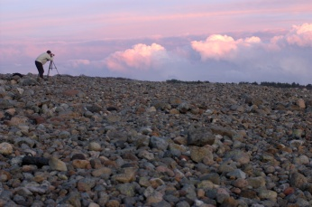
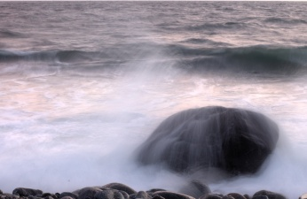
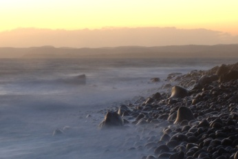

Just too late for sunset
========================

.. articleMetaData::
   :Where: Helgeroa, Norway
   :Date: 20061119 2346 CET
   :Tags: nature, photography

I usually try to get out in the weekend a bit instead of staying inside
the house. The weather was great yesterday so I invited `Sebastian`_ for a little trip to
Mølen to take pictures at sunset. Unfortunately, we were two minutes
too late to see the sun set. Luckily that did not stop us from taking
pictures - just after sunset there is still some sunlight that hits the
clouds turning them red. Here you see Sebastian taking a picture of just
those red clouds:

After the sun sets the light decreases which allows you to play a little
bit with longer exposures. You can get very nice effects such as in this
four second exposure of waves breaking on the (rocky) shore:

If you instead of a close up take a bit wider image of the shore it
gives an eerie feeling just like this shot of the waves and water flowing
in between the rocks that were deposited here by a glacier a long time
ago:

.. _`Sebastian`: http://sebastian-bergmann.de

