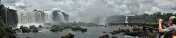

Brasil Conference Wrap-up
=========================

.. articleMetaData::
   :Where: Foz do Iguaçu, Brasil
   :Date: 20061219 1642 CET
   :Tags: conference, holiday, nature, photography, php, travel

In the beginning of this month I attended the `PHP Conference Brasil`_ . Besides speaking on `Xdebug`_ and the `eZ Components`_ I also spend a few
extra days as holiday there.

During those extra days I flew to Foz do Iguaçu to have a look at the `Itaipu dam`_ on the border with Paraguay and `Iguaçu falls`_ .

Besides the falls there are many other things to see in the park, such
as `butterflies`_ and very big ants.

After visiting the park I travelled further south to visit one of my
colleagues, Melissa.
Together we travelled to Gramado, a very German `looking city`_ .

For the rest of the pictures check my `gallery`_ . There
are also a few panoramas available.

.. _`PHP Conference Brasil`: http://www.temporealeventos.com.br/?area=13
.. _`Xdebug`: http://xdebug.org
.. _`eZ Components`: http://ez.no/ezcomponents
.. _`Itaipu dam`: https://www.flickr.com/photos/derickrethans/53002647425/in/album-72177720309330105
.. _`Iguaçu falls`: https://www.flickr.com/photos/derickrethans/53002394731/in/album-72177720309330105
.. _`butterflies`: https://www.flickr.com/photos/derickrethans/53002418564/in/album-72177720309330105
.. _`looking city`: https://www.flickr.com/photos/derickrethans/53002423434/in/album-72177720309330105
.. _`gallery`: https://www.flickr.com/photos/derickrethans/albums/72177720309330105
