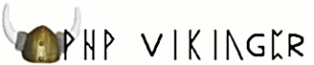

PHP Vikinger unconference open for registration
===============================================

.. articleMetaData::
   :Where: Skien, Norway
   :Date: 20080427 1038 CEST
   :Tags: blog, cms, conference, php, travel

The `PHP Vikinger`_ unconference,
to be held in Skien, Norway on June 21st is now open for `registration`_ . You can find
the full invitation and announcement `here`_ , but I
will repeat the highlights.

First of all, this is a free event, but we do require you to register
for it to see whether we would have enough space. Places to sleep, and
getting to Skien should be arranged by yourself. We made a `information page`_ with
some suggestions though. The `Norwegian PHP User group`_ has reports and videos from `last year`_ . The unconference open
for all, from beginners to advanced PHP users. At the moment there are
about 12 registrations, from people from Norway, Germany, Iceland and
the UK. Hope to see you here!

.. _`PHP Vikinger`: http://phpvikinger.org
.. _`registration`: http://phpvikinger.org/register
.. _`here`: http://phpvikinger.org/news/news-2008-04-22
.. _`information page`: http://phpvikinger.org/directions
.. _`Norwegian PHP User group`: http://php.no
.. _`last year`: http://php.no/phpvikinger

