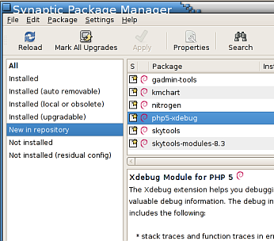

Xdebug finally in Debian
========================

.. articleMetaData::
   :Where: Skien, Norway
   :Date: 20080506 1430 CEST
   :Tags: cms, php, xdebug

.. image:: images/xdebug_logo.png
   :align: left

Since a few days, there is a new package in Debian: `php5-xdebug`_ .
After a few years of talking licenses, due to the help of Martin
Meredith and `François Marier`_ Xdebug can finally be installed with apt-get. See the
synaptic screen shot as well:

.. _`php5-xdebug`: http://lists.debian.org/debian-devel-changes/2008/05/msg00361.html
.. _`François Marier`: http://feeding.cloud.geek.nz/

