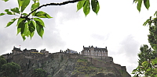
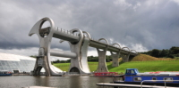
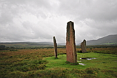
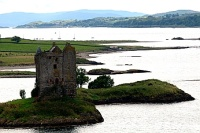
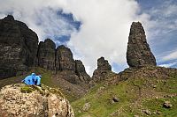
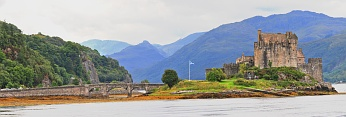
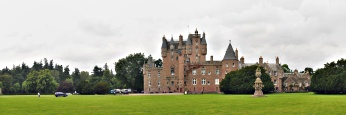

Scotland Holiday
================

.. articleMetaData::
   :Where: Scotland, UK
   :Date: 20080829 2158 CEST
   :Tags: blog, holiday, nature, photography, php, travel

*Edinburgh, August 9th and 10th, 2008*

I had a good flight through Amsterdam to Edinburgh, the real nerves
started when my luggage did not appear on the baggage belt. Apparently I
had missed it and it had fallen off in the back, out of sight. After
being reunited with my bags slightly later and getting the car I made
the arduous trip to the "hotel". The "hotel" was
the Heriot-Watt campus, which was neither sign-posted or easy to find.
After making a few circles through the neighbourhood, I managed to find
it. However, finding the campus wasn't the only issue -- 30 minutes
later I finally had found the reception in a pitch black night. Sleep
commenced very soon after that.

I got up early in the morning for a light breakfast and unhappily
discovered that it was raining. Not something you should be surprised
about in Scotland. I took the bus into town to meet up with Lorna and
after a cup of tea Scott as well. Without any real plan we wandered
around the city and taking in the views. This quickly turned into
looking for food. While having some drinks over lunch we chatted a bit
more, and more walking occurred in the afternoon. We got tired, had some
more drinks and by that time Lorna had to leave for home again.

Scott and I dropped of our gear at his room and went looking for a
comedy show to go to. The Edinburgh Fringe festival was happening, so
the biggest problem was to which of the 640 shows we wanted to go. We
settled for "Des Clarke - Desire" at the Pleasance Courtyard.
After a cup of tea in a café full of loonies, we left for the show. We
had a great time, although his accent was sometimes a bit hard to
understand for me. A cab brought me back to the "hotel".

After
sleeping in a little bit, I took the bus again to downtown Edinburgh. I
took a quick bite to give me strength to visit the Edinburgh castle. I
took the long route through Princess Gardens up the hill. The queue for
tickets took a little over hand an hour. The tour at the castle itself,
was interrupted by the occasional shower, but the weather had improved a
lot since the previous day. The castle is a must see. I liked the
"prison of war" exhibitions best, and the crown jewels where
the anti-climax.

After visiting the castle I was quite hungry and went to have a lunch of
stir fried scallops at the Mussels hut. With the new found energy I
climbed Caston hill. The last hours in Edinburgh I spend at the various
street theaters of the fringe. After a light dinner at "bar
One", consisting of swordfish and an apple/carrot salad I left back
by bus to the Heriot-Watt campus.

*Edinburgh to the Isle of Arran, August 11th, 2008*

I started the day with a simple though hearty breakfast at the newly
opened Mensa. From the hotel I travelled first slightly south to visit
Roslyn's chapel. Unfortunately the chapel is mostly hidden by a roof to
protect it from the rain. Inside photography was not allowed, so I
didn't manage to take any pictures. In the church I listened to a guide
explaining all the interesting art from the chapel. From pagan green
men, the apprentice pillar and the Hollywood circle, the church appeared
to house much more than I expected. From the church I left for Falkirk,
home of the Falkirk Wheel.

The wheel replaces many locks between the Union and Forth and Clyde
canals, and is quite an engineering feat. For some time there was even
some blue sky which made watching the wheel turn more pleasant. I
continued my journey after a quick lunch towards Glasgow and to
Ardrossan where I would take the ferry to the Isle of Arran. I was a bit
early and wandered about the really windy harbour. They also tried to
fool me that my ferry would be two hours later, but that I didn't go
for. The trip of the Firth of Clyde was windy, bumpy and slight sunny.

When I
got the Brodrick on the other side, I shopped for essential energy
suppliers for the upcoming walks around the island. I was staying at the
Catacol Bay hotel on the northern point of the island, where I had
breaded haddock for lunch. The wine that came with it "forced"
me to walk around a bit along the windy coast. The heavy rain that had
plummeted down when I arrived was gone. Before I went to bed I prepared
a bit for the hikes of the following day.

*Isle of Arran, August 12th, 2008*

Hiking
on an empty stomach doesn't work, but a full Scottish breakfast might be
a bit too close to suicide. Way too much artery clogging goodness for
me. Of course, the rain had returned but that was not going to stop me
from a little hike around the "Cock of Arran". From my
"parking place" I spotted a few seals, but they were obviously
not sun-bathing. I didn't walk the whole planned tour as there was
simply too much rain. In the end I was happy that I didn't continue, as
I would have missed some many other things during my really short stay
on Arran.

The next stop on my tour around Arran was a short walk to the standing
stones and stone circles of Machrie Moor. During the two mile hike it
was of course raining still. The last hike of the day was to the King's
caves. I was silly and went the wrong way for nearly half an hour, but
it finally stopped raining. After some dry period I finally ended up at
the caves. There was even some sunshine. The rest of the day I merely
drove around the rest of the island thinking I had no water with me.
Back at the hotel I found six bottles in the trunk. I had dinner in the
hotel's bar and the Hitchhikers Guide to the Galaxy brought and end to
the day.

*Isle of Arran to Isle of Skye, August 13th, 2008.*

A heavy
Scottish breakfast started the day. I left quite early to catch the
ferry at Brodrick back to the mainland. The day consisted of a lot of
driving over narrowish roads. I stopped for a late lunch at a café
overlooking Monty Python's castle Stalker. The weather was getting
better the close I got to Skye. After the Skye bridge beautiful scenery
appeared but I stopped only briefly to take some pictures as it was
getting late too quickly. I didn't really settle in at the lovely
B&B "Roskhill House" until after dinner at Hotel
Dunvegan's bar.

*Isle of Skye, August 14th and 15th, 2008*

A nice breakfast at the B&B started the day. It was beautiful
weather and excellent for my plan to hike to the Quiraing. A quick drive
later over surprisingly good roads--although the last part was a
one-file road--brought me to the parking place at the start of the hike.
From there I walked for ca. 2.5 hours over the maintain range. Very
strange rock formations and beautiful vistas. From there I drove on to
walk to the Cave of Gold but was met by some bulls in a field that I had
to cross. I gave up in fear of my life, and instead drove to Neist's
point and enjoyed the view there in the setting sun.

.. image:: images/quiraing.jpg
   :align: center

I had dinner at "Old School" restaurant. Actually, I had
dinner twice. For some reason my starter--duck--was misunderstood as
another main course by the totally cute, but clumsy waitress (it could
have been *my* accent of course as well). Both dinners were
excellent; if you want to eat here as well, make sure you book on time,
one, if not two days before hand.

The second
day I was woken up by a little rain shower, but luckily the rain was
gone before I was out of the shower. As the weather on the east coast of
the island was supposedly going to be a bit better, I opted for climbing
up to the "Old Man of Storr". A really nice walk with
excellent views -- which got even better when the sun broke through.
From the Storr I traveled up the coast and stopped a few times to enjoy
the views and take some pictures. I ended up doing a walk to a lock,
which was boring. With threatening rain I aborted the walk -- I got back
to the car just before the shower would have soaked me. I had dinner at
the Dunvegan hotel as my first choice, the "Loch Bay Seafood
Restaurant" had no space for me.

*Isle of Skye to Edzell, August 16th, 2008*

Lots of driving again this day. I started off after brekkie for
Scotland's east coast. I took a few compulsory pictures at Eilean Dohan
castle and then drove along the shore of Loch Ness towards Invernness. I
made a quick stop at Urquhart and but not manage to spot Nessie. I
continued my way south from there through beautiful Aberdeenshire where
all the heaths were blossoming. I was staying in a small village, Edzell
at the Kelvingrove B&B. I had dinner at the Panmure Arms Hotel,
which has an interesting setting. The food however was excellent.

*Angus, August 17th, 2008*

Breakfast was early at the B&B which meant that I had some time to
kill before all the attractions opened -- it was a Sunday after all. So
I decided to drive into Glen Clova, the supposedly nicest of the Angus
glens. Unfortunately there was not much too see in the mist. I then
proceeded to Glamis castle, said to have been the set for Shakespeare's
MacBeth. It is very nice, with gardens all around. I found it a bit too
commercial. From there on I visited the Pictavia museum in Brechin
followed by a quick visit to Aberlemno to see a few of those Pictish
stones. It was a bit of a bummer and lame. As last activity of the day I
wanted to walk a little bit along the coast. But at the moment I started
to walk, the rain started to pour down as well. So I aborted and went
back to the B&B to eat, pack and watch a movie. The following day I
was going home again.

*Final notes*

I should definitely have spend more time on Arran and Skye - both
beautiful places of which I've not even seen half.

The food is mostly great in Scotland, as long as you stay away from
Haggis.

My best accommodation was `Roskhill House`_ , there were
also lots of other hikers there, which added to the atmosphere.

I had the least amount of fun in the last day in Angus.

It always rains in Scotland, so bring waterproof gear.

My pictures from the trip are on `flickr`_ .

.. _`Roskhill House`: http://www.roskhillhouse.co.uk/
.. _`flickr`: https://flickr.com/photos/derickrethans/sets/72157606886274251/

