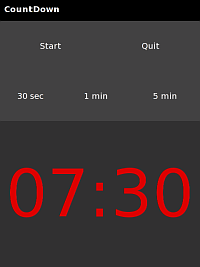

PHP on OpenMoko
===============

.. articleMetaData::
   :Where: Skien, Norway
   :Date: 20080831 1204 CEST
   :Tags: linux, php

Last
week at `FrOSCon`_ I received my new
Linux computer with GSM chip, the `Neo Freerunner`_ . The
device comes with all kinds of goodies, such as GSM, GPS, Wifi,
Bluetooth, motion sensors and a micro SD slot. The hardware works just
fine, but there are some software issues that make the phone not yet
usable for my daily use. Improvements for that are on the way though.

You might be wondering, why the <beep> is this on Planet-PHP as
well. As I mentioned, the Freerunner is basically a Linux computer -
which means total freedom of what you install on it. Traditionally it
comes with perl and python, including GTK bindings. However, no PHP is
found on it. I set out to change that. Unfortunately there were some
issues with cross compiling, so I decided to compile PHP * on* the
phone. There were some issues with this.

The default distribution comes with BusyBox, which implements many
standard Unix commands in one binary - but it doesn't provide the full
version. This makes PHP's configure not work. In order to fix this, you
can install the "coreutils" package, but that was broken at
this time so I had to cross compile coreutils myself (note that you need
to have the `OpenMoko`_ toolchain
installed):

::

	wget http://ftp.gnu.org/gnu/coreutils/coreutils-6.12.tar.gz
	tar -xvzf coreutils*tar.gz
	cd core*
	. /usr/local/openmoko/arm/environment-setup
	./configure --host=arm-angstrom-linux-gnueabi
	make

From
the finished compile, I copied head, expr, env and cut to the /usr/bin
directory on the OpenMoko. With this done, I could compile PHP and
install it to make the headers available for PHP's shared extensions.

After the PHP compile was done, I set out to continue with `php-gtk`_ . For this I had to install a few
more packages: libglade-dev, libglib-dev and m4. Of both compiles I made
packages that you can just install on the OpenMoko: `php`_ and `php-gtk`_ .
In order to demonstrate that it actually works, I've also a demo
application "CountDown" available as `package`_ .

.. _`FrOSCon`: http://froscon.org
.. _`Neo Freerunner`: http://www.openmoko.com/product.html
.. _`OpenMoko`: http://wiki.openmoko.org/wiki/Toolchain
.. _`php-gtk`: http://files.derickrethans.nl/php-gtk_2.0.1-1_arm.ipk
.. _`php`: http://files.derickrethans.nl/php_5.2.6-2_arm.ipk
.. _`package`: http://files.derickrethans.nl/countdown_0.0.1-1_arm.ipk

