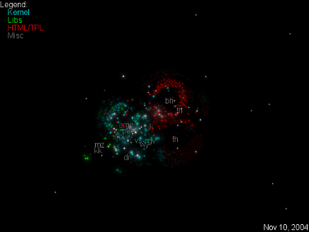

code_swarm
==========

.. articleMetaData::
   :Where: Skien, Norway
   :Date: 20080908 1327 CEST
   :Tags: cms, php, work

Over the weekend I've been playing a bit with `code_swarm`_ - which
visualizes the history of commits in a software project. There `reads`_ : "A
commit happens when a developer makes changes to the code or documents
and transfers them into the central project repository. Both developers
and files are represented as moving elements. When a developer commits a
file, it lights up and flies towards that developer. Files are colored
according to their purpose, such as whether they are source code or a
document. If files or developers have not been active for a while, they
will fade away."

I've run the tool on a few programs I've been involved with, and added
some music track to the movies. Here are the results (click on each
image to see the movie):

PHP

eZ Publish

`eZ Components`_

.. _`code_swarm`: http://code.google.com/p/codeswarm/
.. _`reads`: http://vis.cs.ucdavis.edu/~ogawa/codeswarm/
.. _`eZ Components`: http://ezcomponents.org

