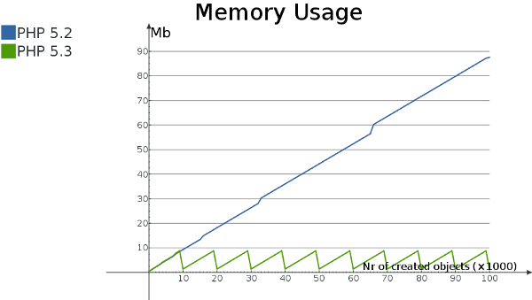

Collecting Garbage: Performance Considerations
==============================================

.. articleMetaData::
   :Where: London, UK
   :Date: 2010-09-13 09:23 Europe/London
   :Tags: blog, php

This is the third (and last) part of three-parts column that was originally
published in the `June 2009`_ issues of `php|architect`_.

.. _`June 2009`: http://www.phparch.com/magazine/2009/june/
.. _`php|architect`: http://www.phparch.com/magazine

Part one is here__ and part two is here__.

__ /collecting-garbage-phps-take-on-variables.html
__ /collecting-garbage-cleaning-up.html

-----

In the previous two parts of this column we have explored PHP's take on
circular referenced variables and a mechanism that allows to clean up this
particular problem with reference counted variable tracking. Of course, the
implementation of the garbage collection mechanism in PHP 5.3 has some
performance impacts. In this third and last part of the column I will cover
the performance implications of the addition of this garbage collection
mechanism.

We have already mentioned in the previous part that simply collecting the
possible roots had a very tiny performance impact, but this is when you
compare PHP 5.2 against PHP 5.3. Although the recording of possible roots
compared to not recording them at all like in PHP 5.2 is slower, other changes
to the PHP runtime in PHP 5.3 prevented this particular performance loss from
even showing.

There are two major areas in which performance is effected. The first area is
the allegedly reduced memory usage, and the second area are run-time delays when
the garbage collection mechanism performs its memory cleanups. We will look at
both of those issues.

Reduced Memory Usage
--------------------

First of all, the whole idea of implementing the garbage collection mechanism
is to reduce memory usage by cleaning up circular referenced variables as soon
as the prerequisites are full-filled. In the implementation in PHP this
happens as soon as the root-buffer is full, or when the function
`gc_collect_cycles()`_ is called. In the first diagram we display the memory
usage of the following script in both PHP 5.2 and PHP 5.3 excluding the base
memory that PHP uses itself when it starts up:

.. _`gc_collect_cycles()`: http://php.net/gc_collect_cycles

::

	<?php
	class Foo
	{
		public $var = '3.1415962654';
	}

	$baseMemory = memory_get_usage(); 

	for ( $i = 0; $i <= 100000; $i++ )
	{   
		$a = new Foo;
		$a->self = $a;
		if ( $i % 500 === 0 )
		{
			echo sprintf( '%8d: ', $i ), memory_get_usage() - $baseMemory, "\n";
		}
	}
	?>

In this very academic example we are creating an object of which a property is
set to point back to the object itself. When the $a variable in the script is
re-assigned in the next iteration of the loop, a memory leak would typically
occur. In this case two zval-containers are leaked (the object zval, and the
property zval), but only one possible root is found—the variable that was
unset. When the root-buffer is full after 10.000 iterators (with in total
10.000 possible roots), the garbage collection mechanism kicks in and frees
the memory associated with those possible roots. This can very clearly be seen
in the jagged memory-usage graph for PHP 5.3. After each 10.000 iterations the
mechanism kicks in and frees the memory associated with the circular
referenced variables. The mechanism itself does not have to do a whole lot of
work in this example, because the structure that is leaked is extremely
simple. From the diagram above you see that the maximum memory usage in PHP
5.3 is about 9 Mb, whereas in PHP 5.2 the memory usage keeps increasing.

Run-Time Slowdowns
------------------

The second area where the garbage collection mechanism influences performance
is when the garbage collection mechanism kicks in to free the "leaked" memory.
In order to see how much this is, we slightly modify the previous script
to allow for a larger number of iterations and the removal of the intermediate
memory usage figures. The script now looks like::

	<?php
	class Foo
	{
		public $var = '3.1415962654';
	}

	for ( $i = 0; $i <= 1000000; $i++ )
	{
		$a = new Foo;
		$a->self = $a;
	}   
		
	echo memory_get_peak_usage(), "\n";
	?>  

We will run this script two times, once with the zend.enable_gc setting turned
on, and once with it turned off::

	time ~/dev/php/php-5.3dev/sapi/cli/php -dzend.enable_gc=0 \
	    -dmemory_limit=-1 -n part3-example2.php	
	# and
	time ~/dev/php/php-5.3dev/sapi/cli/php -dzend.enable_gc=1 \
	    -dmemory_limit=-1 -n part3-example2.php

On my machine the first command seems to take consistently about 10.7 seconds,
whereas the second command takes about 11.4 seconds. This is a slowdown of
about 7%. However, the maximum amount of memory used by the script is reduced
by 98% from 931Mb to 10Mb. This benchmark is not very scientific, or even
representable for real-life applications, but it does demonstrate the memory
usage benefits that this garbage collection mechanism provides. The good thing
is that the slow down is always the same 7% (for this particular script),
while the memory saving capabilities continue to save more and more memory the
more circular references are found during the execution of the script. 

Let's now have a look at non-academic situation. I first started looking for
circular reference collecting algorithms when I found out that while running
the tests of the eZ Components' Template component with PHPUnit I ended up
swapping a lot, and rendering my machine useless in the process.  In order to
do some benchmarks for this article, I re-ran those same tests with an empty
php.ini file to disable the overhead and memory allocation that Xdebug was
creating while doing code-coverage analysis.

The memory usage dropped with 95% from 1.7Gb to 75Mb memory consumption and
the run time as reported by PHPUnit increased from 2:17 for the non-GC enabled
run to 2:33 for the GC enabled run—an increase of about 12%. However, with the
non-GC enabled run, PHP sat there doing "nothing" for almost 15 seconds. Upon
investigation with the Unix debugger GDB I noticed that those 15 seconds were
all spend on freeing memory allocated for objects inside the PHP runtime. The
actual time that the script ran was about the same in the end.

PHP's Internal GC Statistics
----------------------------

It is possible to coax a little bit more information about how the garbage
collection mechanism is run from within PHP. But in order to do so, you will
have to re-compile PHP to enable the benchmark and data-collecting code. You
will have to set the CFLAGS environment variable to -DGC_BENCH=1 prior
to running ./configure with your desired options. In case you have compiled PHP
before, the following sequence should do the trick::

	export CFLAGS=GC_BENCH=1
	./config.nice
	make clean
	make

When you run the above example code again with the newly built PHP binary, you
will see the following being shown after PHP has finished execution::

	GC Statistics
	-------------
	Runs:               110
	Collected:          2072204
	Root buffer length: 0
	Root buffer peak:   10000

	      Possible            Remove from  Marked
	        Root    Buffered     buffer     grey
	      --------  --------  -----------  ------
	ZVAL   7175487   1491291    1241690   3611871
	ZOBJ  28506264   1527980     677581   1025731

The most informative statistics are displayed in the first block. You can see
here that the garbage collection mechanism ran 110 times, and in total more
than 2 million memory allocations where freed during those 110 runs. As soon
as the garbage collection mechanism has run at least one time, the "Root buffer
peak" is always 10.000.

Conclusion
----------

In this final and last installment we had a quick look at the performance
implications of the garbage collection mechanism that is now part of PHP 5.3.
In the general case, it will only cause a slow down when the cycle collecting
algorithm actually runs, whereas in normal (smaller) scripts there should be
no performance hit at all. 

However, in the cases that the cycle collection mechanism does run for normal
scripts, the memory reduction it will provide allows more of those scripts to
run concurrently on your server as not so much memory is used in total.

The real benefits are only there for longer running scripts such as lengthy
test suites or daemon scripts.  Also, for PHP-GTK applications that generally
tend to run longer than scripts for the Web, the new mechanism should make
quite a bit of a difference regarding memory leaks creeping in over time.
