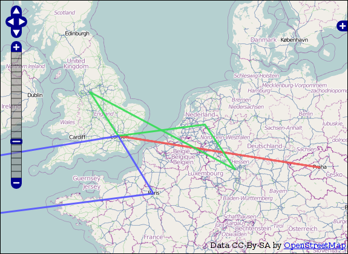

Autumn Conferences
==================

.. articleMetaData::
   :Where: London, UK
   :Date: 2010-09-22 21:14 Europe/London
   :Tags: blog, php, conference, extensions

Autumn started yesterday, and that also marks the start of the 2010 autumn
conference schedule. In the next two and a half months I'll be attending
and speaking at several conferences. Besides some of the older topics
(PHP's date/time extension, and Xdebug_) I will also give a few presentations
on "Geolocation and Maps with PHP". 

The new presentation covers the use of geolocation information with PHP. I will
start with a theoretical background of all the services, mapping systems etc
involved. After that, I will discuss on how to use geo-services from PHP. From
obtaining of geo-location information through databases and services, mapping
services to visualize geo-aware data to geo-aware data storage, manipulation
and querying.

The talks are:

- Debugging with Xdebug_ (WebExpo_, Prague, September 24th)
- Geolocation and Maps with PHP (`PHP NorthWest`_, Manchester, October 9th)
- PHP Inside (IPC_, Mainz, October 12th)
- Geolocation and Maps with PHP (IPC, Mainz, October 13th)
- Advanced Date/Time handling with PHP (ZendCon_, San Jose, November 2nd)
- Haystacks and Needles (`Forum PHP`_, Paris, November 10th)
- Geolocation and Maps with PHP (`Forum PHP`_, Paris, November 10th)

I am looking forwards to meeting all my old friends, and hoping to meet some
new ones too. Come and say hello!

.. _Xdebug: http://xdebug.org
.. _WebExpo: http://webexpo.net
.. _`PHP NorthWest`: http://conference.phpnw.org.uk/phpnw10/
.. _IPC: http://phpconference.com/
.. _ZendCon: http://zendcon.com/
.. _`Forum PHP`: http://afup.org/pages/forumphp2010/
