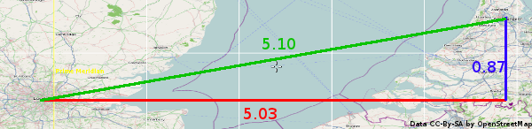
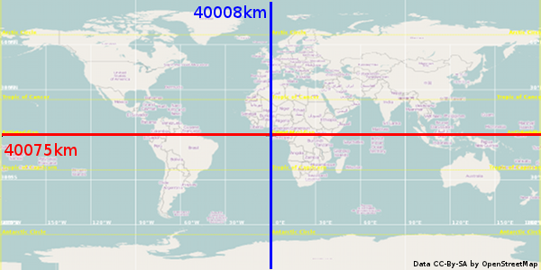
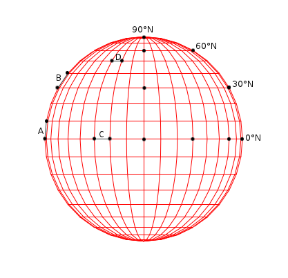
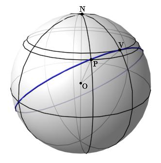

Spatial Indexes: Calculating Distance
=====================================

.. articleMetaData::
   :Where: Montréal, Canada
   :Date: 2011-03-09 07:17 America/Montreal
   :Tags: blog, php, openstreetmap
   :Short: spat-dist

During my "Geolocation and Mapping with PHP" talk that I've given a few times
I briefly touch on the subject of indexes on data-sets of spatial data.
This isn't as simple as just solving `Pythagoras theorem`_ and this article is
meant to clarify this.

**The flat Earth model**

Pythagoras theorem can be used to calculate the distance between two points
quite easily; you take the square root of the square of the absolute vertical
distance plus the square of the absolute horizontal distance; in short::

	d = √(|x1 - x2|² + |y1 - y2|²)

or in PHP::

	$d = sqrt(pow(abs($x1 - $x2), 2) + pow(abs($y1 - $y2), 2));

If you take for example London's coordinates (51.50°N, 0.13°W) and Amsterdam's
coordinates (52.37°N, 4.90°E) we can calculate the distance with::

	d = √(|-0.13 - 4.90|² + |51.50 - 52.37|²)
	d = √(5.03² + 0.87²)
	d = √(26.0578)
	d ≅ 5.10

And on a map:

But what does a difference of "5.10°" actually mean? How far is this in useful
units, such as meters?

If we show the whole map of which the above is an extract, we come to:

The distance around the equator, and through the poles is roughly the same,
40.000km (please be aware that the blue line only shows half of it, the other
half is going through the anti-meridian at 180°W/E). 5.03° in East-West
difference is then about ``40 000 ✕ (5.03/360) = 559 km`` and the North-South
difference about ``20 000 ✕ (0.87/180) = 97 km``. Using those numbers within
the Pythagoras theorem we end up with a distance of ``√(559² + 97²) = 567 km``.
Although the calculation is correct, the answer is still wrong. The real
distance is closer to 360 km.

.. _`Pythagoras theorem`: http://en.wikipedia.org/wiki/Pythagorean_theorem

**The spherical Earth model**

If we look at the Earth in its original (mostly) spherical [#]_ shape, then it's clear
that 10° longitude (East/West) at 60°N is going to be less of a distance than
10°E/W at the equator. It's actually fairly easy to calculate how much 1°
longitude is at 60°N by using ``cos(60) * 1/360 * 6371 * 2π`` [#]_. Or in PHP::

	<?php
	$oneDeg =
		cos(deg2rad(60)) * // adjustment for latitude and radians/degrees
		1/360 * // 1 out of 360°
		6371 * 2 * M_PI, // circumference of the Earth at the equator
		"\n";
	?>

This returns ``55.597 km per °`` for 60°N. The same distance in degrees on the
Equator gives ``6371 * 2 * M_PI / 360 = 111.195``.

The following diagram shows ones more that latitudinal degrees always
correspond with the same distance in kilometer, whereas longitudinal degrees
differ.

In the diagram the line A is a line from 0°N, 90°W to 10°N, 90°W. It has the
same length as line B, from 30°N, 90°W to 40°N, 90°W: a 36th of the
circumference of the Earth through the poles. Line C, from 0°N, 30°W to 0°N,
20°W has the same length. Line D however, from 50°N, 30°W to 50°N, 20°W is
shorter by a factor of ``cos(50°) ≅ 0.64``.

If we look again at the distance between London and Amsterdam, ignore the
differences in latitude and instead pick the average, we see::

	<?php
	$d = abs(-0.13 - 4.90);
	// $d = 5.03 degrees

	$e = 5.03/360 * cos(deg2rad(51.935)) * 6371 * 2 * M_PI;
	$e = 5.03 * 0.617 * 6371 * 2 * M_PI;
	// $e ≅ 345 km
	?>

Which is a bit shorter than the expected 360km, but that's because we
conveniently forgot about the difference in latitude.

Sadly, we can't use Pythagoras's theorem to calculate the real distance with
the latitude difference taken account as well. This is because the theorem is
meant for Euclidean_ geometry, and a sphere does not follow the rules of this
geometry. Instead we need to use a formula that is called the `great-circle
distance`_ formula. The main concept behind it is that a circle is drawn across the
whole sphere that connects both the start (point P) as well as the end (point
V). Then with that circle the distance can be calculated. The following
diagram shows this:

I will spare you how the function is derived, but the distance calculation
ends up as being::

	<?php
	function distance($latA, $lonA, $latB, $lonB)
	{
		// convert from degrees to radians
		$latA = deg2rad($latA); $lonA = deg2rad($lonA);
		$latB = deg2rad($latB); $lonB = deg2rad($lonB);

		// calculate absolute difference for latitude and longitude
		$dLat = ($latA - $latB);
		$dLon = ($lonA - $lonB);

		// do trigonometry magic
		$d =
			sin($dLat/2) * sin($dLat/2) + 
			cos($latA) * cos($latB) * sin($dLon/2) *sin($dLon/2); 
		$d = 2 * asin(sqrt($d));
		return $d * 6371;
	}
	?>

If we punch in our original numbers form London (51.50°N, 0.13°W) and
Amsterdam (52.37°N, 4.90°E), we calculate the following::

	<?php
	$d = distance(51.50, -0.13, 52.37, 4.90);
	echo $d, " km\n";
	?>

Which gives us the expected result of ``358.07 km``.

**Conclusion**

I hope that the above clarified the difference between 2D spatial indexing
with the *flat Earth model* and spatial indexing of geo-located data (*the
spherical Earth model*). In future articles I will go into specific
implementations of spatial indexing by traditional databases such as SQLite,
MySQL and PostGreSQL; NoSQL databases such as MongoDB and CouchDB; and Solr.

.. _Euclidean: http://en.wikipedia.org/wiki/Euclidean_geometry
.. _`great-circle distance`: http://en.wikipedia.org/wiki/Great-circle_distance

.. [#] The Earth is not really a sphere, but an approximation of it. However,
   doing the same calculations for an ellipsoid can (as far as I know) only be
   done by approximation. The difference would hardly matter for finding the
   closest pub.
.. [#] In this article, I've used an average radius of the Earth of 6371 km.
