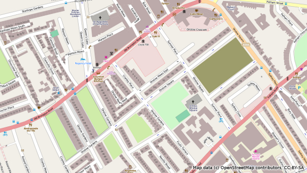

South Kensington Mapping Party Animation
========================================

.. articleMetaData::
   :Where: London, UK
   :Date: 2011-07-19 09:17 Europe/London
   :Tags: blog, openstreetmap
   :Short: sken-vid

Every two weeks or-so, the `London OpenStreetMap group`_ comes together for a
`mapping party`_. The main idea is to go to an area of London to improve
the map there. Sometimes that's adding streets, but as most of those
are now completed, time is spend on buildings, address information and
points-of-interest.

.. _`London OpenStreetMap group`: http://wiki.openstreetmap.org/wiki/London/Summer_2011_mapping_parties
.. _`mapping party`: http://wiki.openstreetmap.org/wiki/Mapping_party

As an experiment I recorded a snapshot of the map for the area
(http://mapcraft.nanodesu.ru/pie/73) every hour to follow the progress of
people adding new and improved data to the map. I then rendered an image
of each map snapshot and put those together to create a video:

.. vimeo::
   :ID: 26470999
   :Width: 599
   :Height: 337
   :Title: South Kensington Mapping Party animation — Map data © OpenStreetMap contributors. CC-BY-SA

You can see the video in HD on Vimeo__.

__ http://vimeo.com/derickr/osm-south-ken

**How Did He Do That?**

Well, first of all, I already have a script to keep a local version
of the London XML map data (as ``london.osm``) up to date. Each hour, this
script:

- Read the old ``london.osm`` file and merge in changes through the
  OpenStreetMap replication_ service and write it as ``london-new.osm``.
- Compare the old file and the new file and write out a changes file to
  ``changes/diff-<timestamp>.osc``. This is not needed for this to work, but
  I am interested in this information as well.
- Move the new file to the old file.
- Import it into my local PostGreSQL/PostGIS instance.

In script form, that looks like::

  #!/bin/bash

  NOW=`date +%Y%m%d-%H%M`

  export JAVACMD_OPTIONS="$JAVACMD_OPTIONS -Djava.net.preferIPv4Stack=true"
  ../osmosis-0.39/bin/osmosis --rri --simc --rx london.osm --ac --bb left=-0.563 right=0.28 top=51.68 bottom=51.26 --wx london-new.osm
  ../osmosis-0.39/bin/osmosis --rx london-new.osm --rx london.osm --derive-change --write-xml-change file="changes/diff-$NOW.osc"
  mv london-new.osm london.osm
  ../try4/bin/osm2pgsql/osm2pgsql -S ../try4/bin/osm2pgsql/default.style --slim -d gis -C 2400 london.osm #-e 15 -o expiry.log

And from that I then can render maps of London quite easily::

  cd /backup/osm/try4/bin/mapnik
  ./generate_tiles_london.py | grep -v " exists"

In order to make a snapshot of South Kensington, or at least, the area that we
were going to map in, I added another task. I placed it just after the moving
of the old file to the new file. This task cuts out the South Kensington area
and puts it in a file ``south-ken/south-kensington-<timestamp>.osm``::

  ../osmosis-0.39/bin/osmosis --rx london.osm --bb left=-0.18256 right=-0.16853 top=51.49426 bottom=51.48733 --wx south-ken/south-kensington-$NOW.osm

This generated about 100 files in the ``south-ken`` directory, where each
XML file contained a snapshot of the map on each specific hour.

I then ran the following script to create a image of each of those map files::

  #!/bin/bash

  export MAPNIK_MAP_FILE=/backup/osm/try4/bin/mapnik/osm.xml
  mkdir -p images
  LAT1=-0.18256
  LON1=51.48833
  LAT2=-0.16853
  LON2=51.49326

  for i in south*osm; do
    /backup/osm/try4/bin/osm2pgsql/osm2pgsql -S /backup/osm/try4/bin/osm2pgsql/default.style --slim -d gis -C 2400 $i
    /backup/osm/try4/bin/mapnik/generate_image.py ${LAT1} ${LON1} ${LAT2} ${LON2}

    mv image.png images/${i}-0.png
    LAT1=`echo "${LAT1} + 0.000005" | bc -q`
    LON1=`echo "${LON1} + 0.00001" | bc -q`
    LAT2=`echo "${LAT2} - 0.00001" | bc -q`
    LON2=`echo "${LON2} - 0" | bc -q`

    /backup/osm/try4/bin/mapnik/generate_image.py ${LAT1} ${LON1} ${LAT2} ${LON2}
    mv image.png images/${i}-1.png
    LAT1=`echo "${LAT1} + 0.000005" | bc -q`
    LON1=`echo "${LON1} + 0.00001" | bc -q`
    LAT2=`echo "${LAT2} - 0.00001" | bc -q`
    LON2=`echo "${LON2} - 0" | bc -q`
  done

I had to modify the ``generate_image.py`` script from the Mapnik_ distribution
slightly to allow the bounding box to be passed in through the command line. I
also set the image width and height to 1280 by 720::

  ...
  ll = [];
  for arg in sys.argv:
      ll.append(arg)
  ll.pop(0);
  for index, arg in enumerate(ll):
      ll[index] = float(arg)

  z = 15
  imgx = 1280
  imgy = 720

  m = mapnik.Map(imgx,imgy)
  ...

Once all the PNG files were created, I converted them to the JPEG format
and ran ``mencoder`` to generate the AVI film::

  for i in *png; do convert -quality 100 $i $i.jpg; done
  mencoder "mf://*.jpg" -mf fps=10 -o test.avi -ovc lavc -lavcopts vcodec=msmpeg4v2:vbitrate=7200

And this video I then uploaded to Vimeo_. Voilà! One OpenStreetMap mapping
party progress animation!

.. _Video: http://vimeo.com/derickr/osm-south-ken
.. _replication: http://wiki.openstreetmap.org/wiki/Minutely_Mapnik
.. _Mapnik: http://mapnik.org/
.. _Vimeo: http://vimeo.com/derickr/osm-south-ken

