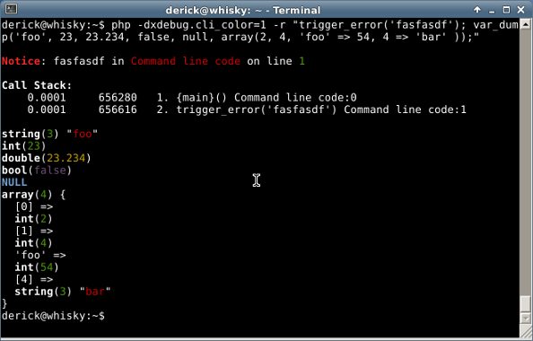
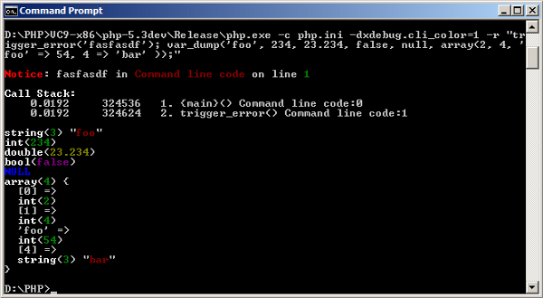

10 years of Xdebug and Xdebug 2.2.0 released
============================================

.. articleMetaData::
   :Where: London, UK
   :Date: 2012-05-08 14:00 Europe/London
   :Tags: blog, php, xdebug
   :Short: xdebug-10

.. image:: images/cake.jpg
   :align: right
   :title: "landhere" — Creative Commons Attribution Share Alike — http://www.flickr.com/photos/landhere/384076624/

Today it has been ten years since the first release of Xdebug: version 0.7.0. I
would like to celebrate this tenth anniversary with a new release: Xdebug 2.2.0.
Xdebug 2.2 adds support for PHP 5.4 and provides some new features:
 
**Colours on the command line**

First of all there is now `var_dump() overloading`_ and `colours on the command line`_.
I've already written about that before, but here are the screenshots again:

Linux/Mac:

Windows:

You can find an article about this here__.

.. _`var_dump() overloading`: http://xdebug.org/docs/display
__ /clicolor-9cr
.. _`colours on the command line`: /clicolor-9cr

**Better support for closures in stack and function traces**

Closures are functions that don't have a function name associated with them.
Therefore, Xdebug creates a pseudo function in its stack traces.  The stack
trace for this example::

	<?php
	function test1()
	{
		$f = function($a, $b) {
			$Q = strlen($a * $b);
			trigger_error('foo');
		};

		$f(5, 25);
	}

	test1();
	?>

Looks like::

	Notice: foo in /tmp/closure-stack-trace.php on line 21

	Call Stack:
		0.0009     268464   1. {main}() /tmp/closure-stack-trace.php:0
		0.0026     269288   2. test1() /tmp/closure-stack-trace.php:27
		0.0032     270024   3. {closure:/tmp/closure-stack-trace.php:19-22}($a = 5, $b = 25) /tmp/closure-stack-trace.php:24
		0.0038     270496   4. trigger_error('foo') /tmp/closure-stack-trace.php:21

In the 3rd line in the call stack you see
``{closure:/tmp/closure-stack-trace.php:19-22}($a = 5, $b = 25)`` where
``/tmp/closure-stack-trace.php:19-22`` contains the filename and line numbers
on which the closure is defined at.

**The size of arrays is now shown with the overloaded variable output**

After this change, each array in the HTML version of the overloaded var_dump()
function now looks like::

	<b>array</b> <i>(size=5)</li>

Before the change, this was only::

	<b>array</b>

**Added the method call type to xdebug_get_function_stack**

This changes adds another array element to `xdebug_get_function_stack()`_ to
show whether it was a static or dynamic function call. For example, for::

	new Error_Entry(false, $errno);

It now adds the ``["type"]=> string(7) "dynamic"`` element to each stack element::

  array(6) {
    ["function"]=>
    string(11) "__construct"
    ["type"]=>
    string(7) "dynamic"
    ["class"]=>
    string(11) "Error_Entry"
    ["file"]=>
    string(%d) "%sbug00241.php"
    ["line"]=>
    int(11)

.. _`xdebug_get_function_stack()`: http://xdebug.org/docs/stack_trace#xdebug_get_function_stack

**Extra information to error printouts to tell that the error suppression operator has been ignored due to xdebug.scream**

When you have the `xdebug.scream`_ option activated, Xdebug will now tell you
when it had any effect on the error reporting with a big "*SCREAM: Error
suppression ignored for*" warning prepended to the actual error message.

.. _`xdebug.scream`: http://xdebug.org/docs/all_settings#scream

**Changelog**

You can find the full changelog for Xdebug 2.2.0 at the `Xdebug website`_ where
you can also download_ the latest version.  If you are using Windows, and don't
know which binary to download, please refer to the wizard_.

.. _`xdebug website`: http://xdebug.org/updates.php#x_2_2_0
.. _download: http://xdebug.org/download.php
.. _wizard: http://xdebug.org/wizard.php

**Support**

If you find Xdebug valuable for your PHP development, perhaps you want to
support its development by acquiring a "support" contract. See the
`buying "support"`_ page if you feel generous.

.. _`buying "support"`: http://xdebug.org/buy-support.php

**What's next?**

Now Xdebug 2.2 is out of the door, I am looking for new features to add to
Xdebug.  What would you like to see added to Xdebug? Please leave a comment
here, or add your feature requests at http://bugs.xdebug.org.
