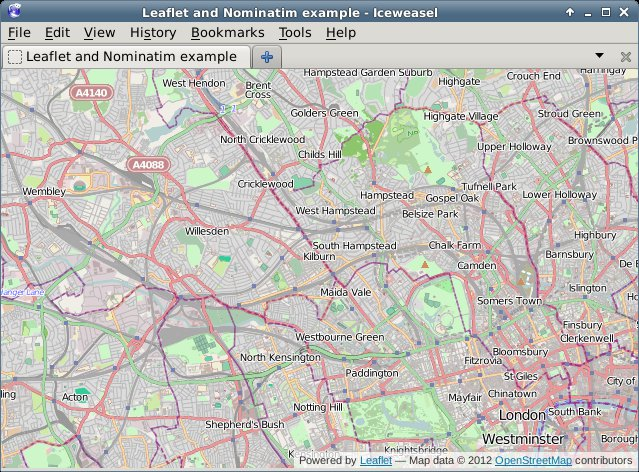
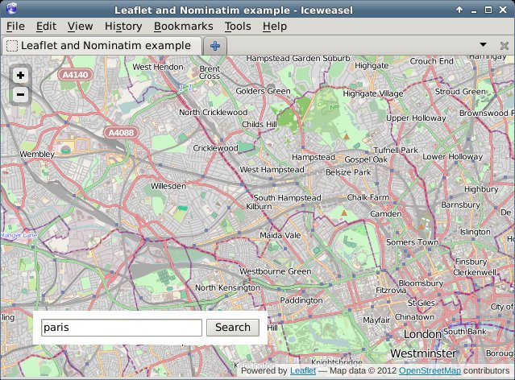
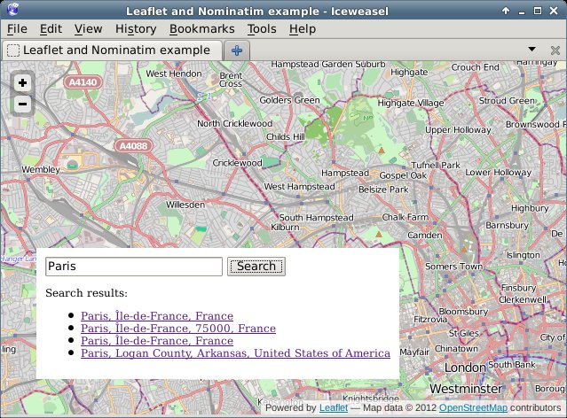
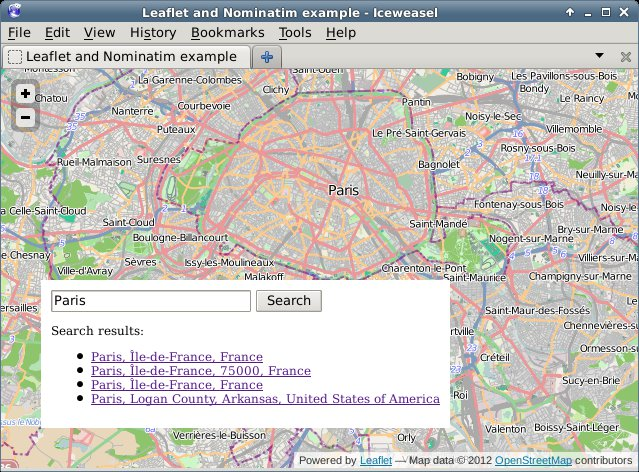

Address lookups with Leaflet and Nominatim
==========================================

.. articleMetaData::
   :Where: London, UK
   :Date: 2012-11-20 10:52 Europe/London
   :Tags: blog, php, openstreetmap
   :Short: addrlookup

I recently wrote a patch_ for `joind.in`_ to add a map of an event's location to
the event detail page. With the same patch, I also replaced the location part
of the event edit page with a solution that uses JQuery_, Leaflet_ as map API,
OpenStreetMap_ tiles_ and Nominatim_ for doing address lookups.  This article
forms a small tutorial on how to use this same set-up yourself.

**The Basics**

To start, we create a new directory for our project::

  mkdir addresses
  cd addresses

Then I downloaded the Leaflet and jQuery libraries and extracted them in the
``js`` directory of the project::

  mkdir js
  curl -L https://github.com/CloudMade/Leaflet/zipball/v0.4.5 -o leaflet.zip
  unzip leaflet.zip
  mv CloudMade-Leaflet-*/dist/* js
  rm -rf CloudMade-Leaflet-*
  rm leaflet.zip
  curl http://code.jquery.com/jquery-1.8.2.min.js -o js/jquery-1.8.2.min.js

As first step, we are simply going to show a map on a web page. The map is
going to be full screen, and will not have any bells and whistles. The code to
embed a map is small, but we will separate it into three files for clarity: a
CSS file for our styles (``site.css``), an HTML file for the structure
(``index.html``) and a JS file for all our JavaScript functions (``js/map.js``).

Let's start with the HTML file::

  <html>
    <head>
      <title>Leaflet and Nominatim example</title>

      <link rel="stylesheet" href="js/leaflet.css" />
      <!--[if lte IE 8]><link rel="stylesheet" href="js/leaflet.ie.css" /><![endif]-->
      <link rel="stylesheet" type="text/css" href="site.css">

      
      
    </head>
    <body>
      

      
    </body>
  </html>

This HTML file includes the Leaflet_ and jQuery_ libraries, as well as the
default CSS file that Leaflet needs.  We are also including our own CSS file
(``site.css``)::

  body {
    margin: 0;
  }
  div#map {
    width: 100%;
    height: 100%;
  }

In the body of the HTML file, we place a ``
`` as contained for the map,
and then include a JavaScript file that is responsible for embedding them map::

  var map;

  function load_map() {
    map = new L.Map('map', {zoomControl: false});

    var osmUrl = 'http://{s}.tile.openstreetmap.org/{z}/{x}/{y}.png',
      osmAttribution = 'Map data &copy; 2012 <a href="http://openstreetmap.org">OpenStreetMap</a> contributors',
      osm = new L.TileLayer(osmUrl, {maxZoom: 18, attribution: osmAttribution});

    map.setView(new L.LatLng(51.538594, -0.198075), 12).addLayer(osm);
  }

  window.onload = load_map; 

If you request the ``index.html`` page now through the browser, you will see
something like:

**Adding the Address Search**

In order to add an address lookup form, we need to add more HTML. Our
HTML will feature an input box (for the address), a submit button, and a place
holder to show our results in. We add this code between the ``
``
and the ``<script...`` tags::

  

    <input type="text" name="addr" value="" id="addr" size="10" />
    <button type="button" onclick="addr_search();">Search</button>
    

  

To style this, we add the following at the end of our CSS file::

  div#search {
    background-color: white;
    position: absolute;
    bottom: 40px;
    left: 40px;
    width: auto;
    height: auto;
    padding: 10px;
  }
  div#search input {
    width: 200px; 
  }
  div#results {
    font-style: sans-serif;
    color: black;
    font-size: 75%;
  }

If we reload the page in our browser, we will see something like:

Now the only thing left to do is to implement the ``addr_search`` function. In
our JS file (``js/map.js``) we add before ``window.onload = load_map;`` the
following lines (split over multiple sections in this tutorial)::

  function addr_search() {
    var inp = document.getElementById("addr");

    $.getJSON('http://nominatim.openstreetmap.org/search?format=json&limit=5&q=' + inp.value, function(data) {

This above line uses jQuery's AJAX capabilities to request a URL, parse the
JSON result and issue a callback if it worked. We query Nominatim_ here, with
as format ``json`` and limiting the result to ``5`` items. Nominatim also
supports other parameters, which are documented here_. ::

      var items = [];

      $.each(data, function(key, val) {
        items.push(
          "<li><a href='#' onclick='chooseAddr(" +
          val.lat + ", " + val.lon + ");return false;'>" + val.display_name +
          '</a></li>'
        );
      });

For each of the items in our result, we create an ``<li>`` element which has an
``<a href`` containing a call to a JavaScript function (``chooseAddr``). This
function is responsible for re-centering the map according to the picked
latitude and longitude. ::

      $('#results').empty();
      if (items.length != 0) {
        $('
', { html: "Search results:" }).appendTo('#results');
        $('<ul/>', {
          'class': 'my-new-list',
          html: items.join('')
        }).appendTo('#results');
      } else {
        $('
', { html: "No results found" }).appendTo('#results');
      }
    });
  }

This processes the results that came back from Nominatim. If there are results,
we shows those including a ``Search results:`` header, and if there are no
results, we show ``No results found``.

Then we need to add one more function, the ``chooseAddr`` function which looks
like::

  function chooseAddr(lat, lng, type) {
    var location = new L.LatLng(lat, lng);
    map.panTo(location);

    if (type == 'city' || type == 'administrative') {
      map.setZoom(11);
    } else {
      map.setZoom(13);
    }
  }

We simply use the latitude and longitude from the function invocation, and in
order to make things slightly nicer we zoom in a bit less if the item type is
either a ``city`` or an ``administrative`` border. As each of the returned
results actually includes a full bounding box, we probably can use that to zoom
in better, but I will leave that for your own experiments - you'd want the
``panInsideBounds()`` method of Leaflet's Map class for that.

In the end, if we click on the ``Search`` button, a list is presented of all
our search results:

And after clicking one of the links, we see the map centered on Paris:

The code for this example is available on github in my ``osm-tools``
repository at
https://github.com/derickr/osm-tools/tree/master/leaflet-nominatim-example

.. _patch: https://github.com/joindin/joind.in/pull/554
.. _`joind.in`: http://joind.in/
.. _jQuery: http://jquery.com
.. _Leaflet_: http://leafletjs.com
.. _OpenStreetMap: http://openstreetmap.org
.. _tiles: http://wiki.openstreetmap.org/wiki/Tiles
.. _Nominatim: http://nominatim.openstreetmap.org/
.. _here: http://wiki.openstreetmap.org/wiki/Nominatim#Parameters
