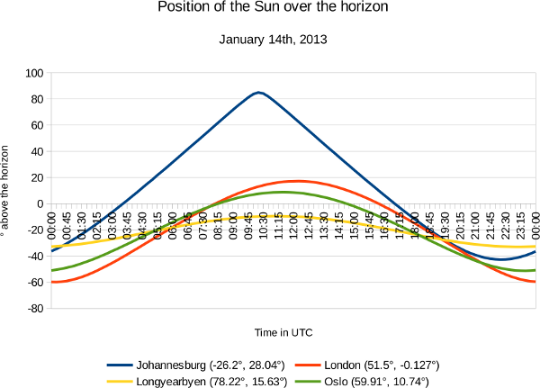

Where is the Sun?
=================

.. articleMetaData::
   :Where: London, UK
   :Date: 2013-01-17 09:14 Europe/London
   :Tags: blog, php
   :Short: where-sun

In a previous article_ I wrote that I am using my Raspberry PI as status
screen showing the weather among things, but I wanted to make the widget that
shows the current weather a bit more interesting. Instead of having the
background black (for nights) and white (for days) I want to have a better
approximation of the lightness of the sky. In order to be able to do this, I
need to know: Where the Sun in the sky is? (In Britain, of course that would
be: Where in the sky is the Sun behind the clouds.)

With PHP's `date_sun_info()`_ function you can easily calculate when the Sun
rises and sets, but it's not useful to determine how far above or under the
horizon the Sun is. For that, I needed to implement a little bit more maths. I
found an excellent tutorial_ online that explains the formulas that are used
to calculate the position of the Sun. The trigonometry and maths go beyond me
at the moment though! 

I've implemented some of those functions in a simple library, called "astro".
You can find it on GitHub at https://github.com/derickr/astro. Right now, it
doesn't implement a lot more than just the position of the Sun, but I am
intending to implement the rest of the algorithms too. 

Of course, just a C-library of some maths isn't very useful if your language
of choice is PHP, so I **also** implemented a tiny PHP extension wrapping the
`astro` library. It's called **solarsystem** and available_ on GitHub as well.
There is only an *earth_sunpos()* function so far, but again, I am intending
to extend on that. 

In order to make use of it, you'll have to run::

	git clone git://github.com/derickr/php-solarsystem.git
	cd php-solarsystem
	git submodule init
	git submodule update
	phpize
	./configure
	make
	make install

Then you can either add ``extension=solarsystem.so`` to php.ini, or run
scripts with ``php -dextension=solarsystem.so yourscript.php``. In the
``tests/`` directory of the Git checkout you can find a script called
``sun-position.php``.  If we examine that, we will see that for four cities
(Johannesburg, London, Longyearbyen and Oslo) we calculate the position of the
Sun for every 15 minutes during January 14th, 2013. The main function there is
``earth_sunpos()`` which takes a Unix timestamp, as well as the latitude and
the longitude of the location for which we want to calculate the Sun's
position.

The script_ produces CSV, that I redirect into a file::

	php -dextension=solarsystem.so sun-position.php > sunpos.csv

I then opened this file in LibreOffice and made a pretty graph out of it:

For Longyearbyen (yellow line) it shows that the Sun never rises as it always
stays below the horizon. It also shows that the highest point over the horizon
is different for London and Oslo—mostly because they are 10° apart
horizontally. For London, you can also see that sunrise happens around 08:00
and sunset around 16:20. 

The position over the horizon, combined with the weather forecast allows me to
calculate the likely lightness of the sky. But that will have to wait to a
future blog post.

.. _article: /suninfo.html
.. _tutorial: http://www.stjarnhimlen.se/comp/tutorial.html
.. _`date_sun_info`: http://php.net/manual/en/function.date-sun-info.php
.. _script: https://github.com/derickr/php-solarsystem/blob/master/tests/sun-position.php
.. _available: https://github.com/derickr/php-solarsystem
