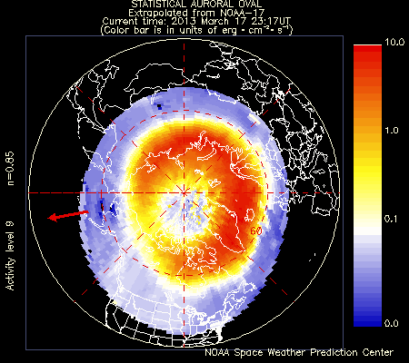
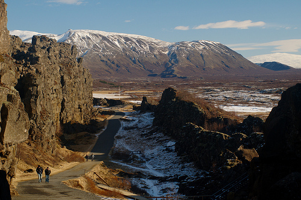
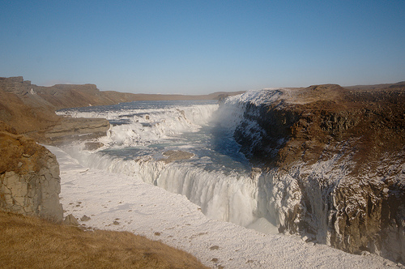
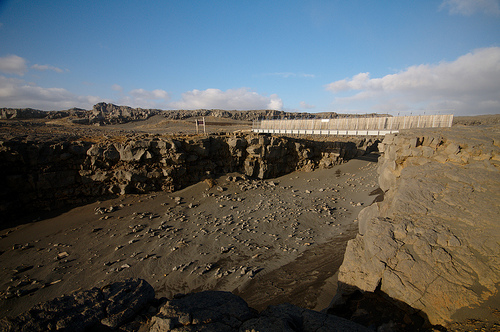

Iceland trip
============

.. articleMetaData::
   :Where: London, UK
   :Date: 2013-03-25 09:11 Europe/London
   :Tags: blog, photography, nature, holiday, travel
   :Short: iceland

**Aurora Borealis**

I have always wanted to see `Aurora Borealis`_ (Northern Lights) and I never
managed to see it the five years I lived in Norway. The Aurora is caused by
the collision of energetic particles coming from the Sun with the atmosphere.
Their typical green colour comes from the interaction of the particles
with Oxygen atoms in the atmosphere. The `auroral mechanism`_ is better
explained on Wikipedia. Because the particles are charged, they are directed
towards the magnetic poles of the Earth.

Aurora gets more intense, and is visible on lower latitudes, when a
`geomagnetic storm`_ is in progress. One of their causes is a 
`coronal mass ejection`_ (CME) on the Sun which sends huge quantities of matter
and electromagnetic radiation out into space. When CMEs are directed towards
Earth they cause a geomagnetic storm which increases the change of Aurora
Borealis to occur.

The `solar cycle`_, which is eleven years is a cycle in which the Sun's activity
goes from very little activity to a lot of activity and back to very little.
During `solar maximum`_ there is a lot higher chance of a CME to occur.
Originally the most recent solar maximum was forecasted to be in 2010 or 2011
but more recent predictions expect it to be this autumn. For some unexpected
reason, Auroras are strongest around the vernal and autumnal equinoxes_.

With it being so close to both the vernal equinox and solar maximum we set off
to Iceland in the hope to be able to see them. The original plan was to seek
them out on the second night of our trip (March 18th) but just before we left
I noticed through the `SpaceWeather`_ site that the Sun produced a solar flare
as well as an Earth-bound CME. Instead of trying our luck the 2nd night we
decided to book an extra excursion_ as chances where very high that we would
see the Aurora on our first night (March 17th). The `Aurora Buddy`_
application that I had installed on my phone had constantly been warning me
about high activity all through Sunday after all. The image above shows the
extend of auroral activity on the night of the 17th. Just when we got on the
bus to travel to some darker skies the Aurora already showed up in the sky
visible through Reykjavik's city lights...

When we got to the viewing location_, the sky was fully alight as you can see
in this timelapse:

.. vimeo::
   :ID: 62515759
   :Width: 599
   :Height: 337
   :Title: Aurora Timelapse, near Vogar, Iceland on March 17th.

This timelapse shows the auroras over a three minute period with a picture
taken every 5 seconds. At a frame rate of 3 frames per second this is sped up
15 times. The show lasted until about midnight, when we headed back to
Reykjavik. Some more still photos are available on flickr__.

**The Golden Circle**

Of course, Iceland has much more to offer than just the occasional show of
Auroras and the next morning we set off on the Golden Circle—a trip past
Iceland's touristic highlights. Our first stop was Þingvellir_, the site
of Alþingi, the first Icelandic parliament that was founded in 930. It is
situated in a rift valley that marks the crest of the `Mid-Atlantic Ridge`_
and is part of Þingvellir National Park.

After Þingvellir we proceeded to the geyser Strokkur_ (Icelandic for "churn").
It's quite spectacular to see a whole lot of water being launched in the air
every 4 to 8 minutes.

Our next stop was Gullfoss_, a waterfall in the river `Hvítá`_.  I had visited
`Gullfoss in summer`_ many many years ago and this trip's experience was quite
different. It was so increadible windy and cold that we could hardly make it
to view the waterfall. However, with the ice surrounding it it was quite
beautiful:

**Smoke and Wind**

The last day of the trip consisted of exploring the Rejkjanes peninsula which
is a large geothermic area. We visited the `Kerið`_ crater, the geothermal
fields `Seltún`_ and Gunnuhver_, the cliffs near Reykjanestá and the
`"Bridge between two continents"`_. The colours of some of the landscapes
were beautiful, but there was a strong cold wind almost everywhere which made
us want to go to the car very fast most of the time. Something to re-explore
in summer I suppose.

**Blue Lagoon**

After a good night's dinner, drinks and rest we spend the last morning of our
trip with our bottoms in the Blue Lagoon to relax. A perfect ending to a
quick, but gorgeous trip in Iceland. We'll be back!

For further photos and timelapses, please see my `flickr set`_.

.. _`geomagnetic storm`: http://en.wikipedia.org/wiki/Geomagnetic_storm
.. _`Aurora Borealis`: http://en.wikipedia.org/wiki/Aurora_Borealis
.. _`solar maximum`: http://en.wikipedia.org/wiki/Solar_maximum
.. _`solar cycle`: http://en.wikipedia.org/wiki/Solar_cycle
.. _`equinoxes`: http://en.wikipedia.org/wiki/Equinox
.. _`auroral mechanism`: http://en.wikipedia.org/wiki/Aurora_Borealis#Auroral_mechanism
.. _`coronal mass ejection`: http://en.wikipedia.org/wiki/Coronal_mass_ejection
.. _`SpaceWeather`: http://www.spaceweather.com/archive.php?view=1&day=15&month=03&year=2013
.. _excursion: http://www.re.is/DayTours/Activity/Details/Northern-Lights-Tour-March-April/
.. _`aurora buddy`: https://play.google.com/store/apps/details?id=com.combatdave.aurorabuddy&hl=en
.. _location: http://osm.org/go/e0UIZxt2-
__ http://www.flickr.com/photos/derickrethans/tags/aurora/
.. _`Þingvellir`: http://en.wikipedia.org/wiki/Thingvellir
.. _`Alþingi`: http://en.wikipedia.org/wiki/Alþingi
.. _`Mid-Atlantic Ridge`: http://en.wikipedia.org/wiki/Mid-Atlantic_Ridge
.. _Gullfoss: http://en.wikipedia.org/wiki/Gullfoss
.. _`Hvítá`: http://en.wikipedia.org/wiki/Hv%C3%ADt%C3%A1,_%C3%81rness%C3%BDsla
.. _`Gullfoss in summer`: http://photos.derickrethans.nl/iceland/abz
.. _Strokkur: http://en.wikipedia.org/wiki/Strokkur
.. _`Kerið`: http://en.wikipedia.org/wiki/Kerid
.. _`Seltún`: http://en.wikipedia.org/wiki/Kr%C3%BDsuv%C3%ADk
.. _Gunnuhver: http://visitreykjanes.is/Searchresults/Attraction/gunnuhver
.. _`"Bridge between two continents"`: http://en.wikipedia.org/wiki/Leif_the_Lucky_Bridge
.. _`flickr set`: http://www.flickr.com/photos/derickrethans/sets/72157633051319974/show/
