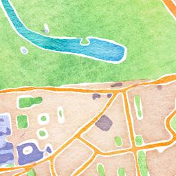

Crowd-serfing
=============

.. articleMetaData::
   :Where: London, UK
   :Date: 2013-04-12 09:27 Europe/London
   :Tags: blog, php, openstreetmap
   :Short: gmm

Yesterday, Google announced_ that they have made Google Map Maker
available in the United Kingdom. Like OpenStreetMap_ it allows
everybody to update and add things to the map. But there is one big
difference: With MapMaker you don't get access to the data.

Fellow OpenStreetMapper, `Richard Fairhurst`_, describes this as
Crowd-serfing:

    Crowd-serfing, n.: when a large corp uses crowd-sourced volunteering
    for its own financial gain, without giving back. See:
    @googlemapmaker.

I will never understand why people do work for a commercial company
without getting any real benefit back:
http://www.bbc.co.uk/news/business-21226623

Unfortunately, today's BBC coverage_ on the availability of Google
MapMaker in the UK read more like a manual on MapMaker than a
nicely unbiased piece on crowd-sourced maps. Only after one of the
OpenStreetMappers reached out to the journalist that wrote the piece,
they added some background on OpenStreetMap_:

    "The biggest problem with Google Map Maker is that anything people
    contribute may appear on Google's map, but only Google can get at
    the underlying data to be able to do anything else with it," said
    `Chris Hill`_.

    "If someone includes a Google map on their web site to show where
    their business is they may also be showing where their competitors
    are and they can't change that."

Sure, it's nice to have some roads on the Google Map, but you will never
even have full access back to your data, unlike OpenStreetMap where you
can download and work with all the data_. Even nicer is
that often, OpenStreetMap still has better maps than GoogleMaps - for
example, have a look at this in North Korea:
http://tools.geofabrik.de/mc/?mt0=mapnik&mt1=googlemap&lon=125.74677&lat=39.01863&zoom=14 .
And closer to home in the United Kingdom, compare some of the hiking
trails in the Peak District:
http://tools.geofabrik.de/mc/?mt0=mapnik&mt1=googlemap&lon=-1.99876&lat=53.17827&zoom=15 .
Even in places like London, the accuracy of the locations of addresses
and points-of-interest (POIs) is often a lot better, as OpenStreetMap doesn't use
web site scraping and post-code-centroid locations to place POIs:
http://tools.geofabrik.de/mc/?mt0=mapnik&mt1=googlemap&lon=-0.12405&lat=51.50862&zoom=18 .
OpenStreetMap mostly relies on surveys, done by individuals (like
you!) to verify things are actually there, aided a little by the
availability of `Bing Maps`_ as background imagery.

One of the things that most people forget, is the terms and conditions
that commercial entities state. An except from MapMaker's reads:

    "You give Google a perpetual, irrevocable, worldwide, royalty-free, and
    non-exclusive licence to reproduce, adapt, modify, translate, publish,
    publicly perform, publicly display, distribute, and create derivative
    works of the user submission."

Note that it never mentions that you can do anything with the data
yourself…

If you are contributing time and knowledge, why not allow yourself to
benefit from it as well? I realise that OpenStreetMap might not be as
accessible, and the map-tiles on their web site aren't the prettiest,
but the real benefit is in the access to the raw data that makes up the
images in the map. The OpenStreetMap wiki also has an article_ on this.

Access to the data allows you to do so many more things. From creating
your own fancy `map-styles`_, creating *"washable, wearable, all-weather
maps designed for the real outdoors"* such as SplashMaps_, to powering
web-sites that show accessibility_. If you don't like the way map data
is rendered, you can produce something in your own style, just like Nike
did with this campaign_.

Also, there is nothing better if some of your handiwork_ shows up in a
`"best of OSM" poster`_ :-) I would never spend my time adding data
to Google's Maps. Instead, I prefer to contribute to OpenStreetMap and
`do awesome things`_ with the data. In the meanwhile, OpenStreetMap
continues to support humanitarian relief efforts in Mali_ and many other
places_.

If you're near London, come and join us this summer_! (Other places will
also run mapping parties).

.. _announced: http://google-latlong.blogspot.co.uk/2013/04/welcoming-united-kingdom-to-google-map.html
.. _OpenStreetMap: http://openstreetmap.org
.. _`Richard Fairhurst`: http://systemed.net/
.. _`Chris Hill`: http://chris-osm.blogspot.co.uk/
.. _data: http://planet.openstreetmap.org/
.. _coverage: http://www.bbc.co.uk/news/technology-22099960
.. _`map-styles`: http://maps.stamen.com/#watercolor/13/51.5068/-0.1055
.. _accessibility: http://wheelmap.org/
.. _handiwork: http://osm.org/go/ZUfFRnGPx-
.. _`"best of OSM" poster`: http://bestofosm.org/poster/
.. _`Bing Maps`: http://www.bing.com/maps/
.. _SplashMaps: http://www.splashmaps.net/
.. _campaign: http://blog.oobrien.com/2010/04/nike-grid/
.. _summer: http://wiki.openstreetmap.org/wiki/London/Summer_2013_events
.. _`do awesome things`: https://vimeo.com/56374742
.. _Mali: https://vimeo.com/61282773
.. _places: http://hot.openstreetmap.org/
.. _article: http://wiki.openstreetmap.org/wiki/Google_Map_Maker
