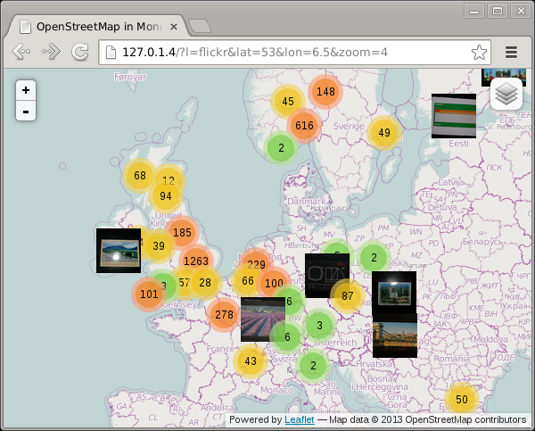
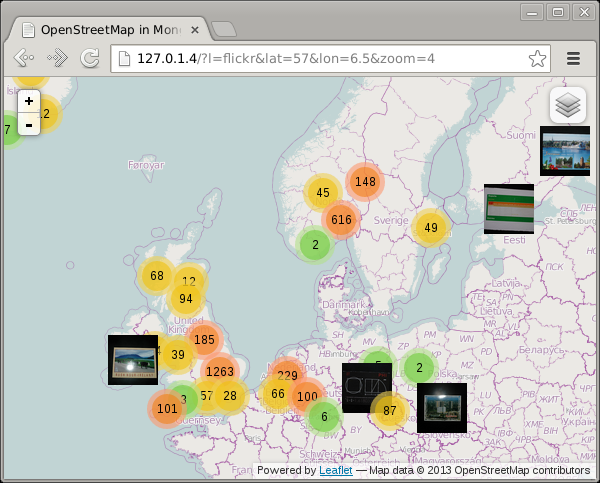
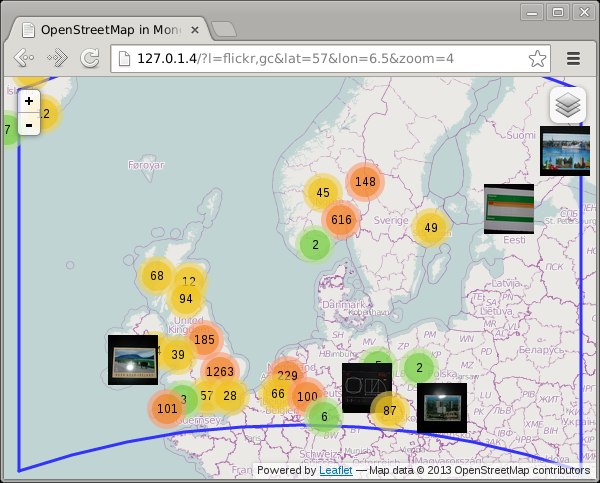
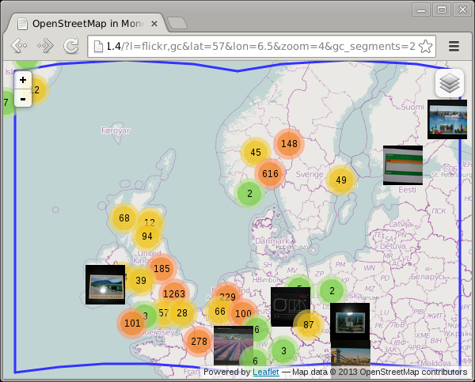
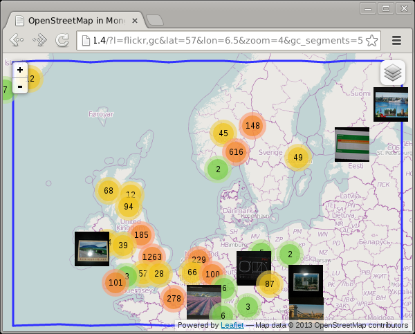

Flat vs. Sphere
===============

.. articleMetaData::
   :Where: London, UK
   :Date: 2013-07-16 09:33 Europe/London
   :Tags: blog, mongodb, php, openstreetmap
   :Short: gc

For the preparation of my `Finding Pubs... (and other things)`_ presentation
that I gave at the PHP NorthWest usergroup some time ago I created a demo that
shows all my flickr photos_ on a map. For example like:

This example shows photos in the UK, Norway and Sweden as well as in Paris.

In order to not find too many photos that are not going to be in the portion of
the world that the display covers, I add a bounding box to my find() query::

	$polygon = GeoJSONPolygon::createFromBounds(
		min( 90, (float) $_GET['n'] ),
		min( 180, (float) $_GET['e']) ,
		max( -90, (float) $_GET['s'] ),
		max( -180, (float) $_GET['w'] )
	);

	$c = $d->selectCollection( 'flickr' );
	$query = array(
		LOC => array(
			'$geoWithin' => array(
				'$geometry' => $polygon->getGeoJSON(),
			),
		),
	);
	$s = $c->find( $query )->limit( 8000 );

The North, East, South and West points are being passed as argument to the
``fetch-poi.php`` script_ like:
http://127.0.1.4/maps-flickr/fetch-poi.php?n=65.44000165965534&e=32.51953125&s=46.07323062540838&w=-19.51171875

Now if we scroll up a bit to include Iceland in the map, then we see that the
photos in Paris disappear:

How is that possible? Let's first see what our polygon looks like::

	<?php
	include 'classes.php';

	$_GET = array(
		'n' => 65.44000165965534,
		'e' => 32.51953125,
		's' => 46.07323062540838,
		'w' => -19.51171875,
	);

	$polygon = GeoJSONPolygon::createFromBounds(
		min( 90, (float) $_GET['n'] ),
		min( 180, (float) $_GET['e']) ,
		max( -90, (float) $_GET['s'] ),
		max( -180, (float) $_GET['w'] )
	);

	var_dump($polygon);
	?>

Which outputs::

	class GeoJSONPolygon#1 (1) {
	  public $pg =>
	  array(1) {
		[0] =>
		array(5) {
		  [0] =>
		  array(2) {
			[0] => double(32.51953125) [1] => double(65.440001659655)
		  }
		  [1] =>
		  array(2) {
			[0] => double(-19.51171875) [1] => double(65.440001659655)
		  }
		  [2] =>
		  array(2) {
			[0] => double(-19.51171875) [1] => double(46.073230625408)
		  }
		  [3] =>
		  array(2) {
			[0] => double(32.51953125) [1] => double(46.073230625408)
		  }
		  [4] =>
		  array(2) {
			[0] => double(32.51953125) [1] => double(65.440001659655)
		  }
		}
	  }
	}

The 5 array elements in here reflect in order the North East point, the North
West point, the South West point, the South East point and again the North East
point. If we draw lines between those points on the map, we find:

Which instantly shows you why I got missing photos! As you can see, the
shortest line between vertical lines is a straight line on a sphere, but the
horizontal lines are **not** straight. The shortest path on a sphere, as
expressed with a `Spherical Mercator`_ projection is often a curve, called
the `Great Circle`_ path. Because MongoDB's ``2dsphere`` index is a true
spherical index (as opposed to the ``2d`` index which cheats), the polygon it
uses to find the photos is not a *square* as you can see in the image above.
This illustrates the main difference between spherical geospatial queries, and
ones that only deal with a flat rectangular map.

Leaflet_, the mapping library that I use, does not actually draw lines as
Great Circle paths, so I had to calculate them myself. The
`maps-great-circle`_ code on GitHub shows how I did that. Basically I
created points along the Northern and Southern border on the exact latitude.

If you create one intermediate point, the result is:

And with five intermediate points you hardly notice the problem anymore:

Play around with the ``gc_segments`` URL parameter to see for yourself:

 - http://maps.derickrethans.nl/?l=flickr,gc&zoom=5&gc_segments=1
 - http://maps.derickrethans.nl/?l=flickr,gc&zoom=5&gc_segments=2
 - http://maps.derickrethans.nl/?l=flickr,gc&zoom=5&gc_segments=3
 - http://maps.derickrethans.nl/?l=flickr,gc&zoom=5&gc_segments=10

Next up in the series is "Showing all the World's Timezones" which will explain
how I created the tiles that highlight the timezones at
http://maps.derickrethans.nl/?l=timezones&lon=50&lat=30&zoom=3

.. _`Finding Pubs... (and other things)`: http://derickrethans.nl/talks/phpnw-2013
.. _photos: http://maps.derickrethans.nl/?l=flickr
.. _script: https://github.com/derickr/3angle/blob/master/maps-flickr/fetch-poi.php
.. _`Spherical Mercator`: http://en.wikipedia.org/wiki/Mercator_projection#The_spherical_model
.. _`Great Circle`: http://en.wikipedia.org/wiki/Great-circle_distance
.. _Leaflet: http://leafletjs.com
.. _`maps-great-circle`: https://github.com/derickr/3angle/blob/master/maps-great-circle/fetch-poi.php
