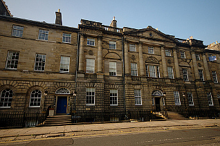
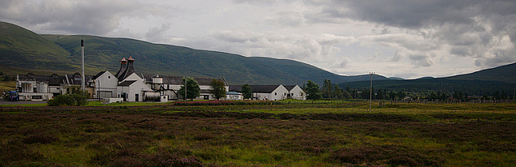
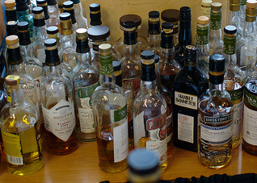
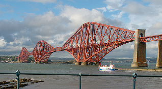
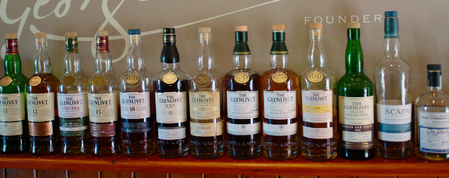

The day I saved whisky
======================

.. articleMetaData::
   :Where: Edinburgh, UK
   :Date: 2013-09-21 09:54 Europe/London
   :Tags: blog, whisky, holiday
   :Short: whiskytour

I don't usually write about non-technical things on this blog, but for once I
will be describing my holiday adventures. A week and a bit ago I returned from
a week long trip to Edinburgh and Speyside to get up and close with some of my
favourite products: Scotch Single Malt Whisky. I think that I managed, as
during the week I probable tasted around 50 different whiskies. Some of that
was on our own accord at Albanach_ in Edinburgh, but we also participated in a
three day Whisky tasting tour with `Rabbie's Trail Blazers`_ in Speyside_,
home to more than 50 distilleries. 

But before we embarked on the boozy tour, we spent some time in Edinburgh. I
love the city. Although I have been to Edinburgh before, I had never visited
many of the tourist attractions. So this time we went out and visited 
the `National Trust`_ property `Georgian House`_ on `Charlotte Square`_, the
`Royal Yacht Brittania`_, and the `Royal Botanic Garden Edinburgh`_. In the
evenings we tried many many different whiskies at Albanach_ (a list will
follow at the end).

On Wednesday morning Morag and I turned up on the `Royal Mile`_ for our
`whisky tour`_. The nature of this tour had me slightly worried that we would
be the youngest couple by far, but that turned out not to be too much of the
case. We left in our small bus (16 people) and just after lunch in Dunkeld_ we
stopped at `The Hermitage`_ (OSM__) to stretch our legs. We went then onwards
to our first distillery: Dalwhinnie_.

__ http://en.wikipedia.org/wiki/The_Hermitage_%28Scotland%29

Dalwhinnie is run by Diageo and the visit had a bit of a corporaty feeling to
it. Our guide was alright and managed to explain the basics of how a distillery
works. We tasted four different Dalwhinnies. After Dawhinnie we headed for
`Grantown-on-Spey`_ where we would stay for two nights at `Dunallan House`_, a
lovely bed and breakfast with a friendly host. We had pie for dinner at `The
Craig Bar`_ (they only do pies), and after dinner we went for a stroll in
`Anagach Woods`_ along the river Spey, followed by a few drams at the `Garth
Hotel`_.

.. _`Garth Hotel`: http://www.garthhotel.com/

The following morning we got up early for a 9:30! tour of the Benromach_
distillery. This tour of one of the smallest distilleries was led by a veteran
whisky maker with an unbelievable amount of knowledge about whisky making. Not
only was the tour itself excellent, the gentleman also talked us through
the whisky tasting instead of just giving us four whiskies. Morag ended up
buying a `Benromach Origins Batch 4`_. After lunch our next stop was at the
famous `Gordon and MacPhail`_ shop in Elgin. They are actually the owners of
the Benromach distillery as well. The shop is mostly known for their own
special bottlings of whiskies. I ended up buying a bottle of a bottling of an
Imperial. This distillery is now closed, and has had its buildings demolished.
I still have to try it. 

In the afternoon we visited another distillery, Cardhu_. It is, like
Dalwhinnie, also owned by Diageo and sometimes called "the heart of Johnnie
Walker". When we came to the spirit still during our tour, we noticed that
there was a liquid spurting out of one of the stills. And with this being our
third tour, I didn't think that was supposed to happen. After notifying our
guide, she quickly called maintenance which came hurrying to investigate.
After seeing the leak for themselves they fetched some putty to plug the
whole—whisky saved! It later turned out to be the head, so no
whisky-in-the-making was actually lost. However, both the tour, and the
whiskies that we tasted were underwhelming—especially after our earlier tour
and tasting at Benromach. 

In the evening we struggled finding a place to eat in Grantown on Spey and
ended up having a curry at Sylhet. After dinner we had a nice long walk in the
woods North of Grantown on Spey before retiring to the Craig Bar for a little
dram before bed time.

On our last day our first stop was at the Glenlivet_ distillery. Another large
distillery—the best selling in the US and the second best selling globally.
The tour was good and instead of a tasting measure of whisky, we received
a generous dose. For a few quid we also ended up tasting the more exclusive
Glenlivet 21. The next stop was the `Speyside Cooperage`_, a company that
refurbishes and repairs casks. 

It is quite fascinating to see how coopers go
about their job, but it was not nearly as impressive as our next stop on the
tour: `The Whisky Castle`_. Hidden away in the tiny town of Tomintoul_, the
Whisky Castle has a decent range of whiskies, but it is more impressive that
the proprietor selects his own casks to bottle. And he doesn't mind letting
you taste his own selections... After six tastings I ended up leaving with two
exclusive bottles and a very good mood. After a quick photo-op of the `Forth
Rail Bridge`_ we made it back to Edinburgh.

On our last day we hoped to see the pandas and `Edinburgh Zoo`_, but with Tian
Tian pregnant, and Yang Guang ill that didn't work out. We still had a
good day out seeing lots of animals. We met up with Michael_ for dinner at
`Cafe Marlayne`_ where I'd eaten before. Although the food is great, the behaviour of
their staff was not really acceptable this time. Doubt that I'll return.

On the last day we visited another National Trust property right on the Royal
Mile, `Gladstone's Land`_. Some retail (whisky) therapy, a last drink at
Albanach, and a climb up `Calton Hill`_ marked the end of the holiday.

The photos of this trip can be found on flickr__.

__ https://www.flickr.com/photos/derickrethans/sets/72157635475131074/

*The tasted whiskies*

 - `Aberfeldy 21`_
 - `Ancnoc 16`_
 - `Ardbeg Uigeadail`_
 - `Balblair 2002`_
 - `Balvenie 15 Single Barrel #1225`_
 - `Benromach 10`_
 - `Benromach 2002`_
 - `Benromach Organic`_
 - `Benromach Origins Batch 4`_
 - `Bowmore`_
 - Gordon & MacPhail "Exclusive": Bunnahabhein
 - `Bruichladdich Islay Barley 2006`_
 - `Cardhu 12`_
 - `Cardhu Special Cask Reserve`_
 - `Càrn Mòr "Speyside" from Mortlach distillery`_
 - `Dailuaine 16`_
 - `Dalwhinnie 15`_
 - `Dalwhinnie 25`_
 - `Dalwhinnie Distiller's Edition`_
 - Dalwhinnie 1997 Single Cask
 - `Fettercairn Fior`_
 - `Glen Garioch 1995`_
 - Gordon & MacPhail "Exclusive": Glenburgie
 - `GlenDronach`_
 - `Glencadam`_
 - `Glenfarclas 21`_
 - `Glenlivet 15`_
 - `Glenlivet 21`_
 - `Glenmorangie Astar`_
 - `Glenmorangie Nectar D'or`_
 - The Whisky Castle Cask Collection No 23 (Glenrothes)
 - `Glentauchers 1991`_
 - `Kilchoman Machir Bay`_
 - `Ledaig 10`_
 - `Linkwood 15`_
 - `Macallan Amber`_
 - `Mortlach 16`_
 - `Rosebank 21`_
 - `Royal Brackla 1991`_
 - `Strathmill 12`_
 - `Talisker Distiller's Edition`_
 - `Teannich 10`_
 - `Tobermory 15`_
 - `Tomatin 15`_
 - `Tomintoul 12 Portwood Finish`_
 - `Tomintoul 12 Sherry Finish`_
 - `Tomintoul 16`_
 - "Malt of the moment" - Tomintoul
 - `Tormore 12`_
 - `Yamazaki 18`_

.. _`Aberfeldy 21`: http://www.amazon.co.uk/gp/product/B004CFD9FW/ref=as_li_ss_tl?ie=UTF8&camp=1634&creative=19450&creativeASIN=B004CFD9FW&linkCode=as2&tag=derickrethans-21
.. _`Ancnoc 16`: http://www.amazon.co.uk/gp/product/B008CYXA3A/ref=as_li_ss_tl?ie=UTF8&camp=1634&creative=19450&creativeASIN=B008CYXA3A&linkCode=as2&tag=derickrethans-21
.. _`Ardbeg Uigeadail`: http://www.amazon.co.uk/gp/product/B008U7SUE8/ref=as_li_ss_tl?ie=UTF8&camp=1634&creative=19450&creativeASIN=B008U7SUE8&linkCode=as2&tag=derickrethans-21
.. _`Balblair 2002`: http://www.amazon.co.uk/gp/product/B00CA7RMJS/ref=as_li_ss_tl?ie=UTF8&camp=1634&creative=19450&creativeASIN=B00CA7RMJS&linkCode=as2&tag=derickrethans-21
.. _`Balvenie 15 Single Barrel #1225`: http://www.amazon.co.uk/gp/product/B00E5OK8PY/ref=as_li_ss_tl?ie=UTF8&camp=1634&creative=19450&creativeASIN=B00E5OK8PY&linkCode=as2&tag=derickrethans-21
.. _`Benromach 10`: http://www.amazon.co.uk/gp/product/B002VPW39S/ref=as_li_ss_tl?ie=UTF8&camp=1634&creative=19450&creativeASIN=B002VPW39S&linkCode=as2&tag=derickrethans-21
.. _`Benromach 2002`: http://www.amazon.co.uk/gp/product/B008CYXTCM/ref=as_li_ss_tl?ie=UTF8&camp=1634&creative=19450&creativeASIN=B008CYXTCM&linkCode=as2&tag=derickrethans-21
.. _`Benromach Organic`: http://www.amazon.co.uk/gp/product/B00BM3BUK8/ref=as_li_ss_tl?ie=UTF8&camp=1634&creative=19450&creativeASIN=B00BM3BUK8&linkCode=as2&tag=derickrethans-21
.. _`Benromach Origins Batch 4`: http://www.amazon.co.uk/gp/product/B00DCELY0G/ref=as_li_ss_tl?ie=UTF8&camp=1634&creative=19450&creativeASIN=B00DCELY0G&linkCode=as2&tag=derickrethans-21
.. _`Bowmore`:  http://www.amazon.co.uk/gp/product/B00BM3CVFG/ref=as_li_ss_tl?ie=UTF8&camp=1634&creative=19450&creativeASIN=B00BM3CVFG&linkCode=as2&tag=derickrethans-21
.. _`Bruichladdich Islay Barley 2006`: http://www.amazon.co.uk/gp/product/B009T47W4A/ref=as_li_ss_tl?ie=UTF8&camp=1634&creative=19450&creativeASIN=B009T47W4A&linkCode=as2&tag=derickrethans-21
.. _`Cardhu 12`: http://www.amazon.co.uk/gp/product/B00439YHT4/ref=as_li_ss_tl?ie=UTF8&camp=1634&creative=19450&creativeASIN=B00439YHT4&linkCode=as2&tag=derickrethans-21
.. _`Cardhu Special Cask Reserve`: http://www.amazon.co.uk/gp/product/B001GLKC9Q/ref=as_li_ss_tl?ie=UTF8&camp=1634&creative=19450&creativeASIN=B001GLKC9Q&linkCode=as2&tag=derickrethans-21
.. _`Càrn Mòr "Speyside" from Mortlach distillery`: http://www.masterofmalt.com/whiskies/mortlach/mortlach-16-year-old-1996-strictly-limited-carn-mor-whisky/
.. _`Dailuaine 16`: http://www.amazon.co.uk/gp/product/B004EAHJLK/ref=as_li_ss_tl?ie=UTF8&camp=1634&creative=19450&creativeASIN=B004EAHJLK&linkCode=as2&tag=derickrethans-21
.. _`Dalwhinnie 15`: http://www.amazon.co.uk/gp/product/B002FAVFDE/ref=as_li_ss_tl?ie=UTF8&camp=1634&creative=19450&creativeASIN=B002FAVFDE&linkCode=as2&tag=derickrethans-21
.. _`Dalwhinnie 25`: http://www.amazon.co.uk/gp/product/B00AFC1XYK/ref=as_li_ss_tl?ie=UTF8&camp=1634&creative=19450&creativeASIN=B00AFC1XYK&linkCode=as2&tag=derickrethans-21
.. _`Dalwhinnie Distiller's Edition`: http://www.amazon.co.uk/gp/product/B004EAIZY0/ref=as_li_ss_tl?ie=UTF8&camp=1634&creative=19450&creativeASIN=B004EAIZY0&linkCode=as2&tag=derickrethans-21
.. _`Fettercairn Fior`: http://www.amazon.co.uk/gp/product/B00652UVUQ/ref=as_li_ss_tl?ie=UTF8&camp=1634&creative=19450&creativeASIN=B00652UVUQ&linkCode=as2&tag=derickrethans-21
.. _`Glen Garioch 1995`: http://www.amazon.co.uk/gp/product/B0097B6X3Q/ref=as_li_ss_tl?ie=UTF8&camp=1634&creative=19450&creativeASIN=B0097B6X3Q&linkCode=as2&tag=derickrethans-21
.. _`GlenDronach`: http://www.amazon.co.uk/gp/product/B0029Z902I/ref=as_li_ss_tl?ie=UTF8&camp=1634&creative=19450&creativeASIN=B0029Z902I&linkCode=as2&tag=derickrethans-21
.. _`Glencadam`: http://www.amazon.co.uk/gp/product/B002VPUPI4/ref=as_li_ss_tl?ie=UTF8&camp=1634&creative=19450&creativeASIN=B002VPUPI4&linkCode=as2&tag=derickrethans-21
.. _`Glenfarclas 21`: http://www.amazon.co.uk/gp/product/B001GLIC8Y/ref=as_li_ss_tl?ie=UTF8&camp=1634&creative=19450&creativeASIN=B001GLIC8Y&linkCode=as2&tag=derickrethans-21
.. _`Glenlivet 15`: http://www.amazon.co.uk/gp/product/B003U2I98A/ref=as_li_ss_tl?ie=UTF8&camp=1634&creative=19450&creativeASIN=B003U2I98A&linkCode=as2&tag=derickrethans-21
.. _`Glenlivet 21`: http://www.amazon.co.uk/gp/product/B005UXNAX6/ref=as_li_ss_tl?ie=UTF8&camp=1634&creative=19450&creativeASIN=B005UXNAX6&linkCode=as2&tag=derickrethans-21
.. _`Glenmorangie Astar`: http://www.amazon.co.uk/gp/product/B00BEWGYC6/ref=as_li_ss_tl?ie=UTF8&camp=1634&creative=19450&creativeASIN=B00BEWGYC6&linkCode=as2&tag=derickrethans-21
.. _`Glenmorangie Nectar D'or`: http://www.amazon.co.uk/gp/product/B009GJR15I/ref=as_li_ss_tl?ie=UTF8&camp=1634&creative=19450&creativeASIN=B009GJR15I&linkCode=as2&tag=derickrethans-21
.. _`Glentauchers 1991`: http://www.amazon.co.uk/gp/product/B003ZIU3VU/ref=as_li_ss_tl?ie=UTF8&camp=1634&creative=19450&creativeASIN=B003ZIU3VU&linkCode=as2&tag=derickrethans-21
.. _`Kilchoman Machir Bay`: http://www.amazon.co.uk/gp/product/B008CYZP74/ref=as_li_ss_tl?ie=UTF8&camp=1634&creative=19450&creativeASIN=B008CYZP74&linkCode=as2&tag=derickrethans-21
.. _`Ledaig 10`: http://www.amazon.co.uk/gp/product/B003ZIQMKG/ref=as_li_ss_tl?ie=UTF8&camp=1634&creative=19450&creativeASIN=B003ZIQMKG&linkCode=as2&tag=derickrethans-21
.. _`Linkwood 15`: http://www.amazon.co.uk/gp/product/B0043A2RZY/ref=as_li_ss_tl?ie=UTF8&camp=1634&creative=19450&creativeASIN=B0043A2RZY&linkCode=as2&tag=derickrethans-21
.. _`Macallan Amber`: http://www.amazon.co.uk/gp/product/B00CP2WES2/ref=as_li_ss_tl?ie=UTF8&camp=1634&creative=19450&creativeASIN=B00CP2WES2&linkCode=as2&tag=derickrethans-21
.. _`Mortlach 16`: http://www.thewhiskyexchange.com/P-4085.aspx
.. _`Rosebank 21`: http://www.amazon.co.uk/gp/product/B008CYYIA4/ref=as_li_ss_tl?ie=UTF8&camp=1634&creative=19450&creativeASIN=B008CYYIA4&linkCode=as2&tag=derickrethans-21
.. _`Royal Brackla 1991`: http://www.amazon.co.uk/gp/product/B005IMZSI4/ref=as_li_ss_tl?ie=UTF8&camp=1634&creative=19450&creativeASIN=B005IMZSI4&linkCode=as2&tag=derickrethans-21
.. _`Strathmill 12`: http://www.amazon.co.uk/gp/product/B001LLZUIY/ref=as_li_ss_tl?ie=UTF8&camp=1634&creative=19450&creativeASIN=B001LLZUIY&linkCode=as2&tag=derickrethans-21
.. _`Talisker Distiller's Edition`: http://www.amazon.co.uk/gp/product/B0043A3TGU/ref=as_li_ss_tl?ie=UTF8&camp=1634&creative=19450&creativeASIN=B0043A3TGU&linkCode=as2&tag=derickrethans-21
.. _`Teannich 10`: http://www.amazon.co.uk/gp/product/B0043A1PF2/ref=as_li_ss_tl?ie=UTF8&camp=1634&creative=19450&creativeASIN=B0043A1PF2&linkCode=as2&tag=derickrethans-21
.. _`Tobermory 15`: http://www.amazon.co.uk/gp/product/B006Z51ELS/ref=as_li_ss_tl?ie=UTF8&camp=1634&creative=19450&creativeASIN=B006Z51ELS&linkCode=as2&tag=derickrethans-21
.. _`Tomatin 15`: http://www.amazon.co.uk/gp/product/B003ZIOQKE/ref=as_li_ss_tl?ie=UTF8&camp=1634&creative=19450&creativeASIN=B003ZIOQKE&linkCode=as2&tag=derickrethans-21
.. _`Tomintoul 12 Portwood Finish`: http://www.amazon.co.uk/gp/product/B006OAUFQY/ref=as_li_ss_tl?ie=UTF8&camp=1634&creative=19450&creativeASIN=B006OAUFQY&linkCode=as2&tag=derickrethans-21
.. _`Tomintoul 12 Sherry Finish`: http://www.amazon.co.uk/gp/product/B00439ZTIW/ref=as_li_ss_tl?ie=UTF8&camp=1634&creative=19450&creativeASIN=B00439ZTIW&linkCode=as2&tag=derickrethans-21
.. _`Tomintoul 16`: http://www.amazon.co.uk/gp/product/B00439Y8FC/ref=as_li_ss_tl?ie=UTF8&camp=1634&creative=19450&creativeASIN=B00439Y8FC&linkCode=as2&tag=derickrethans-21
.. _`Tormore 12`: http://www.amazon.co.uk/gp/product/B0029ZFVXA/ref=as_li_ss_tl?ie=UTF8&camp=1634&creative=19450&creativeASIN=B0029ZFVXA&linkCode=as2&tag=derickrethans-21
.. _`Yamazaki 18`: http://www.amazon.co.uk/gp/product/B00F7SHURG/ref=as_li_ss_tl?ie=UTF8&camp=1634&creative=19450&creativeASIN=B00F7SHURG&linkCode=as2&tag=derickrethans-21

I have tasting notes for most of those, but that will have to wait until a new
post. Slàinte!

.. _Albanach: http://www.albanach-edinburgh.co.uk/
.. _`Rabbie's Trail Blazers`: http://www.rabbies.com/
.. _Speyside: http://en.wikipedia.org/wiki/Speyside_single_malts
.. _`Royal Yacht Brittania`: http://www.royalyachtbritannia.co.uk/
.. _`Royal Botanic Garden Edinburgh`: http://www.rbge.org.uk/
.. _`National Trust`: http://www.nationaltrust.org.uk/
.. _`Georgian House`: http://www.nts.org.uk/Property/Georgian-House/
.. _`Charlotte Square`: http://www.openstreetmap.org/#map=18/55.95176/-3.20758
.. _`Royal Mile`: http://osm.org/go/evfLjtDB~?m=
.. _`whisky tour`: http://www.rabbies.com/tours_scotland_edinburgh/speyside_whisky_trail_3_day_tour.asp
.. _Dunkeld: http://en.wikipedia.org/wiki/Dunkeld
.. _`The Hermitage`: http://en.wikipedia.org/wiki/The_Hermitage_%28Scotland%29
.. _Dalwhinnie: http://en.wikipedia.org/wiki/Dalwhinnie_distillery
.. _`Grantown-on-Spey`: http://en.wikipedia.org/wiki/Grantown-on-Spey
.. _`Dunallan House`: http://www.dunallan.com/
.. _`The Craig Bar`: http://www.thecraigbar.co.uk/
.. _`Anagach Woods`: http://osm.org/go/e6NqF37v--
.. _Benromach: http://www.benromach.com
.. _`Benromach Origins Batch 4`: http://www.masterofmalt.com/whiskies/benromach/benromach-origins-2003-port-pipes-batch-4-whisky/
.. _`Gordon and MacPhail`: http://www.gordonandmacphail.com/
.. _Cardhu: http://en.wikipedia.org/wiki/Cardhu
.. _Glenlivet: http://en.wikipedia.org/wiki/Glenlivet_Distillery
.. _Speyside Cooperage`: http://www.speysidecooperage.co.uk/
.. _`The Whisky Castle`: http://www.whiskycastle.com/
.. _Tomintoul: http://osm.org/go/e6OW0YYu
.. _`Forth Rail Bridge`: http://en.wikipedia.org/wiki/Forth_rail_bridge
.. _Michael: http://mgdm.net/
.. _`Cafe Marlayne`: http://www.cafemarlayne.com/
.. _`Edinburgh Zoo`: http://www.edinburghzoo.org.uk/
.. _`Gladstone's Land`: http://en.wikipedia.org/wiki/Gladstone%27s_Land
.. _`Calton Hill`: http://en.wikipedia.org/wiki/Calton_Hill
