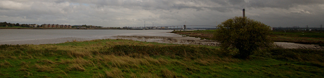
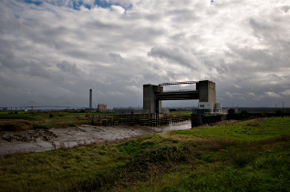
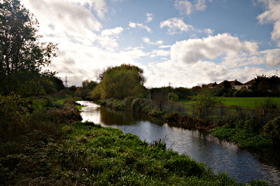
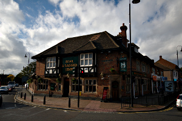
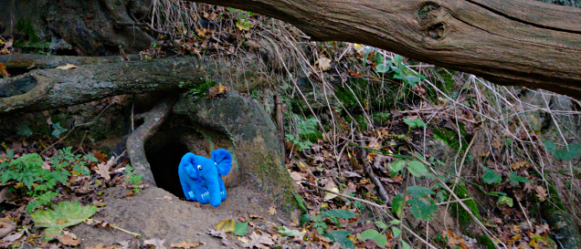
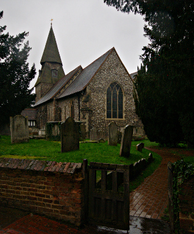

Walking the London LOOP - part 1
================================

.. articleMetaData::
   :Where: London, UK
   :Date: 2013-10-28 09:23 Europe/Berlin
   :Tags: blog, theloop, walking
   :Short: loop1

I have been in the UK for about five years now since I moved from Norway. When
I lived there, I loved my walks in the hills and mountains around Skien. Now
I am trying to do 10.000 steps each day, I would like a bit more variety than
busy London roads. I have been doing some walks past old Tube infrastructure,
and have made some excursions to Yorkshire for walking, but walking through
green areas is not particularily easy when you live in London. 

A while ago I ran into the `Walk London`_ website, which advertises seven
small and large walking routes in and around London. One of the longer ones 
is the `LOOP walk`_ — roughly following the inside of the M25 around London.
At 153 miles it is not something you do in a day (or even a year!) but it is
divided in 24 sections that vary from 3.5 to 10 miles. The first one is one
of the longer ones, 8.5 miles and starts in the town of Erith. And that is
where Morag, the elephpant and I started our walking tour around the LOOP.

Getting to Erith is relatively simple, we just took a train from London Bridge
station. On Saturdays it goes every 10 minutes. The start of the LOOP was easy
enough to walk although we got a bit lost with all the `odd paths`_ near the
river. Once we got past all the scrap yards that seems to litter this area we
finally got to the Thames on the Thames Path SE extension.

A pleasent walk past the Erith and Crayford marches. The QE2 bridge that makes
up part of the Dartford crossing was easy to spot in the east. The Erith
marshes contain quite a bit of World War II anti-aircraft equipment of which
hints could still be seen. 

After a while along the Thames, we walked around another scrap metal yard and
ended up at the river Darent (or Darent Creek—we saw both names). From there
the walk went inland. The first thing we spotted was the `Darent Flood 
Barrier`_. It was not the prettiest site in the landscape, but it has of course
an important feature preventing the river Darent (and Cray) to be pushed full
of water from the Thames in times of high water. OpenStreetMap indicates that
at some point there might be NCN_ going over/through it, but right now there is
no way that is now.

After following the river Darent and the mud flats that surround it for about
half an hour, we started following the river Cray towards Crayford. Besides a
bit of industrial land (another scrap yard!) the walk along the Cray river was
pleasent, with autumn colours and muddy paths—just what you would expect for
an autumn walk.

We stopped for lunch at the `Bear & Ragged Staff`_, a Greene
King pub with some ales and very standard pub grub. For future walks I might
investigate a bit more at which pub we should stop for lunch! With our tummies
filled, we continued with the final stretch of the walk.

Crossing the playing fields near `Hall Place`_ we quickly found ourselves near
the river Cray again where the paths became muddier and the clouds darker.
Once we managed to cross over the the railway and under the A2_ the drizzle
started.

Turning into small woods on the way to Bexley, the trees saved us from most of
the rain that had now started in earnest. However at the end, there was about
500 meters to go into Bexley.

We took a bit of a side tour through St. Mary the Virgin's cemetary and after a
quick photo op of the church itself we speeded towards the station. In better
weather we would probably have stopped in Old Bexley for a bit longer for a cup
of tea—or perhap something stronger. The village is apparently quite pleasent,
and we might just have a look around when we get there again for the second
section of the LOOP!

The signage of this first section was pretty decent, except through Crayford
and a little at the start near the Thames. Perhaps the latter was because we
had not gotten into walking mode yet! All in all, the walk was flat, generally
along the river or through some woods with a few ugly industrial estate to go
past.

The weather was mostly pleasent at ~15°C with quite a bit of wind and sunny
spells at the start. The last bit of the walk after Crayford started with
drizzle and we ended with rain at Bexley station.

For the full photo series, see my `Flickr set`_.

.. _`Walk London`: http://www.walklondon.org.uk
.. _`LOOP walk`: http://www.walklondon.org.uk/route.asp?R=5
.. _`odd paths`: http://osm.org/go/0EENQDlgb?m=
.. _`Darent Flood Barrier`: http://en.wikipedia.org/wiki/River_Darent
.. _NCN: http://www.sustrans.org.uk/ncn/map/national-cycle-network
.. _`Bear & Ragged Staff`: http://www.yelp.co.uk/biz/bear-and-ragged-staff-crayford
.. _`Hall Place`: http://www.bexleyheritagetrust.org.uk/hallplace/
.. _A2: http://osm.org/go/0EEG5pLoS--?m=
.. _`Flickr set`: http://www.flickr.com/photos/derickrethans/sets/72157636982853053/

