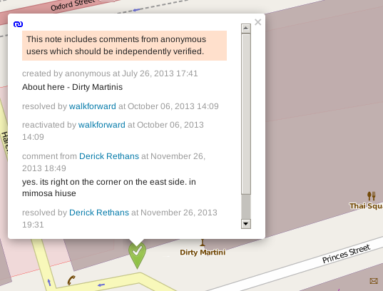
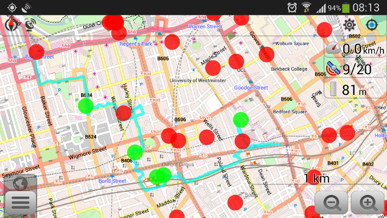
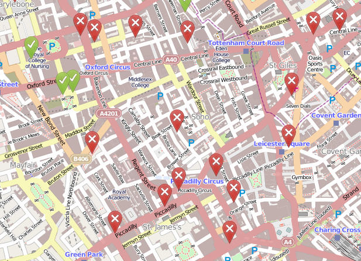

Contributing Advent 5: OpenStreetBugs
=====================================

.. articleMetaData::
   :Where: London, UK
   :Date: 2013-12-05 09:10 Europe/London
   :Tags: blog, openstreetmap
   :Short: adv1305

Adding and updating data on OpenStreetMap is fairly easy and available for
everybody. But once in a while you don't really have the time to add things to
the map, and for those situations OpenStreetMap has the Notes_ functionality.

The Notes functionality allows anybody to add a note to the map with some
details of things that are mapped incorrectly, or not mapped at all.

Take for example the following note:

This note can be found on the website_ too.

Many of the notes require validation or checking, so I decided to check out a
few notes before the most recent OpenStreetMap London `pub meet-up`_. I like
walking anyway, so walked from Baker Street towards Oxford Street in a
zigzaggy line towards the pub. You can see the GPS trace here taken from a
screenshot on OsmAnd_, which has a nice little Notes plugin/interface.

What this also shows, is the 5 notes that I closed (the green dots)!

However, there are still plenty of notes left in central London:

If you have an OpenStreetMap account, and are logged in, you can add comments
and/or resolve issues if you know how to edit OpenStreetMap. Maybe you can
have a look in your own `local area`_ and resolve some notes!

.. _Notes: http://wiki.openstreetmap.org/wiki/Notes
.. _website: http://www.openstreetmap.org/?note=17777#map=19/51.51448/-0.14356&layers=N
.. _`pub meet-up`: http://wiki.openstreetmap.org/wiki/London/Winter_2013-2014_events
.. _OsmAnd: http://osmand.net/
.. _`local area`: http://www.openstreetmap.org/#map=14/51.5211/-0.1213&layers=N
