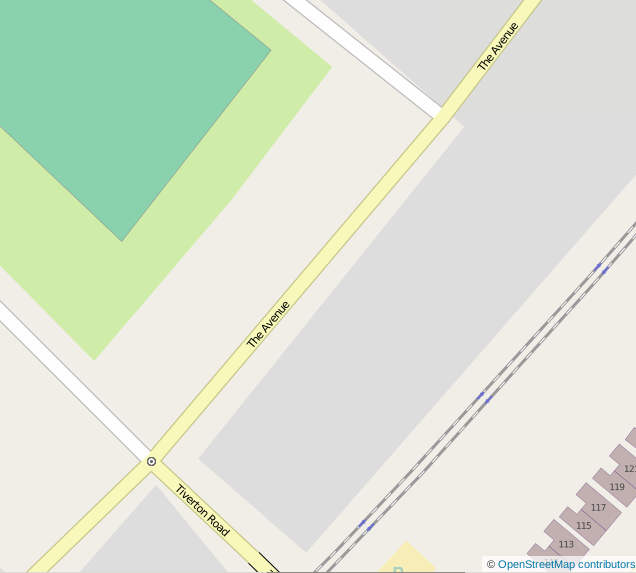
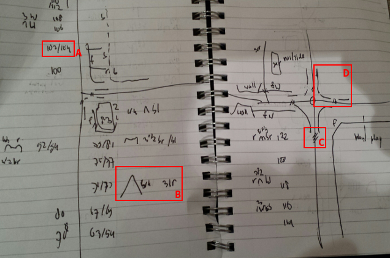
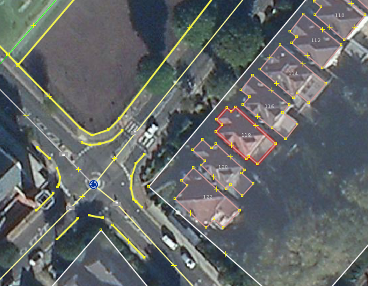
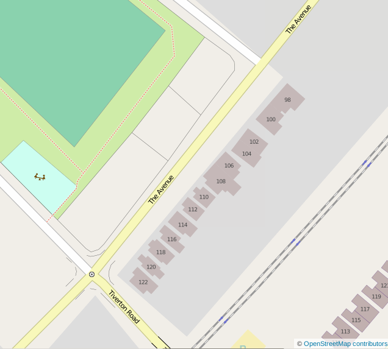

Contributing Advent 19: Lunch time mapping
==========================================

.. articleMetaData::
   :Where: London, UK
   :Date: 2013-12-19 09:10 Europe/London
   :Tags: blog, openstreetmap
   :Short: adv1319

I like going out for walks at lunch time. At least during winter times, it's
the only amount of fresh air during daylight I am actually getting. During my
walks, I also like to do something useful. Then, my laptop's background image
shows me an OpenStreetMap_ map of the area the laptop is currently at. (This
now works a lot better again after Mozilla started doing their 
`location project`_). When I am at home, this background however has this
(empty) spot on it:

And empty spots are annoying! So, during a lunch break in the last few days, I
went out and walked over `The Avenue`_ to do some mapping. I find it way
easier to do this with pen and paper, as compared to an application like
Vespucci_. Pen and paper is both faster, and I don't have to fiddle with a
tiny phone keyboard. I do however use Vespucci for things like changing a
shop's name or type.

Notes on pen and paper I make plenty, and they look like this:

Over the past few years I have developed a short hand for all kinds of things.
You can see house numbers (a), how many floors, the colour of the building,
the shape and colour of the roof (b), crossings (c) and fences (d) on the
extract above.

With the notes on paper, I then use JOSM_ to add the information to the map.
JOSM's interface looks like:

JOSM is a little bit like the VIM_, but then for editting OpenStreetMap. It is
not the easiest editor, but so much more powerfull than the online editor iD_.
With some practice, and learning key combinations, it allows you to pretty
quickly add the information from your notes to the map. The following video
(at 8 times speed) shows how I added the information from the notes from above
to the map:

.. vimeo::
   :ID: 81856483
   :Width: 640
   :Height: 480
   :Title: Contributing Advent 19: Lunch time mapping

In the end, when everything has been added and uploaded, and the
OpenStreetMap_ website rendered my updates, the map now looks like:

Now it is just a matter of adding the information from the other eight pages
of notes I made on this trip!

.. _OpenStreetMap: http://www.openstreetmap.org/about
.. _`location project`: /advent11.html
.. _JOSM: http://josm.openstreetmap.de
.. _VIM: http://vim.org
.. _`The Avenue`: http://www.openstreetmap.org/way/4072795
.. _Vespucci: http://wiki.openstreetmap.org/wiki/Vespucci
.. _iD: http://wiki.openstreetmap.org/wiki/ID 
