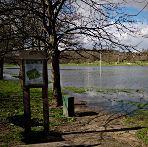
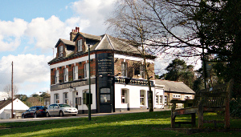
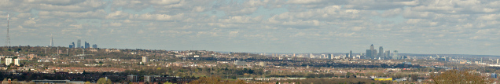
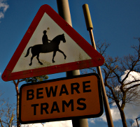
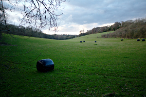

Walking the London LOOP - part 4
================================

.. articleMetaData::
   :Where: London, UK
   :Date: 2014-03-25 09:09 Europe/London
   :Tags: blog, theloop, walking
   :Short: loop4

Another weekend, and another section of the LOOP_. This time Morag and I left
home a bit earlier as we knew this was one of the longer sections of the LOOP
at 9 miles. 

We took the train to Hayes (Kent) and followed a slightly different route to
the start of the section. At the end of last one we really could do without
the two fairly steep hills. After getting to the start, we soon found
ourselves on the Greenwich Meridian, even though the GPS indicated crossing
the line about 200 meters earlier. Passing St. John's church the LOOP wanted
to takes us right through a "lake", previously the Sparrows Den Playing
Fields, but currently flooded due to high levels of ground water. Some
jokers had also put a bunch of yellow rubber ducks on the "lake".

We found our way around the field and continued towards our first wooded
section, afraid of more mud. Instead, we were greated by a collapsed tree on
the path. Some mud did show up, but not nearly as much as on previous
sections. We came out of the woods and had to follow a decent stretch along
a road, then past a "high school" and its playing fields until we came past
a promising looking pub, `The Sandrock`_. Although it was open, it was so
quiet in there that we continued by climbing up the `Addington Hills`_ to treat
us to a fine panorama over London. Wembley Stadium, the City and Canary
Wharf were all very easy to spot.

After a quick break and avoiding having Chinese food we came onto
Tramlink_ station Coombe Lane after which we disappear in more woods.
This time around `Heathfield House`_ and `Bramley Bank`_. From there we
continued onwards towards *more* woods (can you believe it!) and around a
water tower.

By now, we were definitely hungry (and thirsty) so we decided to make a
slight detour into Selsdon to have a bite and pint at `The Sir Julian
Huxley`_, a Weatherspoons.

After lunch we continued our walk by going through more woods: `Selsdon
Wood`_ and Puplet Wood. For the first time, we went just outside of Greater
London into Surrey. After encountering Elm Farm in Farleigh we fled back
into London past some fields to make it to Hamsey Green, the end of the
walk. If the previous sections could be called "muddy", this section clearly
had a preference for "woods". A bus, train and two tubes later we got home,
exhausted.

The weather was mostly good, but colder at 10-12°C and some rain threatened
to wet us near the start. We took just over four and a half hours for the
21.1km walk (including detours).

The photos that I took on this section, as well as the photos of the
other sections of the LOOP, are available as a `Flickr set`_.

.. _LOOP: http://www.walklondon.org.uk/route.asp?R=5
.. _`The Sandrock`: http://www.thesandrockpub.com/
.. _`Addington Hills`: http://en.wikipedia.org/wiki/Addington_Hills
.. _Tramlink: http://en.wikipedia.org/wiki/Tramlink
.. _`Heathfield House`: http://www.croydononline.org/history/heritage/heathfield_house.asp
.. _`Bramley Bank`: http://www.croydon.gov.uk/leisure/parksandopenspaces/parksatoz/bramley/
.. _`The Sir Julian Huxley`: http://www.jdwetherspoon.co.uk/home/pubs/the-sir-julian-huxley
.. _`Selsdon Wood`: http://en.wikipedia.org/wiki/Selsdon_Wood
.. _`Puplet Wood`: 
.. _`Flickr set`: http://www.flickr.com/photos/derickrethans/sets/72157636982853053/with/13378241064
