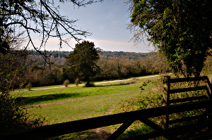
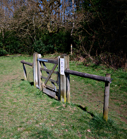
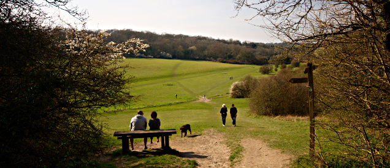
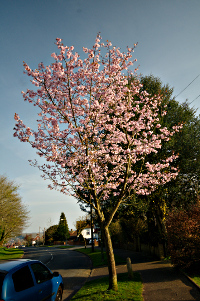
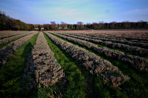

Walking the London LOOP - part 5 and 6
======================================

.. articleMetaData::
   :Where: London, UK
   :Date: 2014-04-01 09:11 Europe/London
   :Tags: blog, theloop, walking
   :Short: loop56

Section 5
---------

While waking up we already knew this would be a glorious day. Blue skies with
no clouds in sight. The moment I got out of the house I knew I was not going
to need my coat either. Getting to Hamsey Green, the start of section 5 was a
bit more of a chore than normally. It involved two tube trains to Victoria, a
train to West Croydon and then another bus ride down the road to Ken's Auto
at Hamsey Green. 

After a short section next to a road, we entered Riddlesdown_. With mostly
open fields and a bit of woodland we made it down into the next valley,
coming past a disused quarry. We only really noticed the quarry once we made
it over a bridge across some railroad tracks and up a fairly steep path up
the hill on the other side of the valley. 

.. _Riddlesdown: http://en.wikipedia.org/wiki/Riddlesdown_Common

After some steps, and some more steep uphill part we came to `Kenley
Common`_, a now open space that used to be farmland, as a swap for the
`Kenley Aerodrome`_ that the RAF seconded during the second World War. We
made a few wrong turns on Kenley Common and there were a few slightly useless
fences. Passing through some woods and a field with gliders overhead, we
"suddenly" found ourselves at the `Wattenden Arms`_, a pub displaying much
WWII memorabilia from the Kenley Aerodrome. The friendly staff served a
decent pint, and after refreshing ourselves we continued the walk.

.. _`Kenley Common`: http://en.wikipedia.org/wiki/Kenley_Common#Kenley_Common
.. _`Kenley Aerodrome`: http://en.wikipedia.org/wiki/RAF_Kenley
.. _`Wattenden Arms`: http://www.thewattendenarmskenley.co.uk/

After climbing our first style we were overtaken by another LOOP walker as we
passed by the `Kenley Observatory`_ and a friendly horse. For a bit we had to
walk past a road without footpath or pavement. 

.. _`Kenley Observatory`: http://www.croydonastro.org.uk/kenley-observatory.html

After that we passed by a field with a sole postbox and then made our way to
`Happy Valley`_. With the Sun blazing and everything looking greener that it
probably was we descended into the valley and back out on the other end. The
signing of the LOOP was a bit confusing so I don't think we followed the
route correctly, but we picked up the walk again just shy of the next common, 
`Farthing Downs`_.

.. _`Happy Valley`: http://en.wikipedia.org/wiki/Happy_Valley_Park
.. _`Farthing Downs`: http://en.wikipedia.org/wiki/Farthing_Downs

This part of the walk was over a hill crest with the skyline of London in the
far background. The section ended with a slight downhill into Coulsdon were
we stopped for some refreshments—most importantly cake—at the `Poppy Cafe`_.
Because the weather was so nice, we decided to continue with the following
section as well, section 6.

.. _`Poppy Cafe`: http://www.poppycafe.co.uk/

Section 6
---------

Passing through South Coulsdon station we had a long climb up a residential
road before we continued on a bridleway. With a long section through some
woods and farmland around, a slight detour around a road without pavement, we
came upon the `Mayfield Lavender Fields`_. Sadly, we were too early to see it
all in bloom, but there was most definitely already a hint of purple to be
seen.

.. _`Mayfield Lavender Fields`: http://www.mayfieldlavender.com/

We then walked through Oak's Park, after which there was another long
straight section on the edge of Surrey that took us past `HMP Highdown`_.
Luckily most of it was hidden by hedges and trees. The last part of this much
shorter section took us to the `Banstead Downs`_ and over the Banstead Downs
Golf Club to the end of the walk. From there it was a short link to Banstead,
where we luckily only had to wait 20 minutes for the train—there is only a
service every hour.

.. _`HMP Highdown`: http://www.justice.gov.uk/contacts/prison-finder/high-down
.. _`Banstead Downs`: http://en.wikipedia.org/wiki/Banstead_Downs

Where section 5 was mostly known for its up and downs, section 6 was the
"horse" section. Lots of bridleways and horses around.

The weather was very good, with 16-18°C and no clouds to be seen. We took
nearly four and a half hours for the two sections that together were 19.4km
long.

The photos that I took on this section, as well as the photos of the
other sections of the LOOP, are available as a `Flickr set`_.

.. _LOOP: http://www.walklondon.org.uk/route.asp?R=5
.. _`Flickr set`: https://www.flickr.com/photos/derickrethans/sets/72157636982853053/with/13533902384
