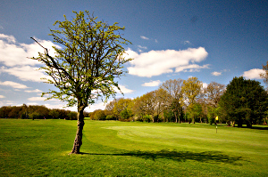
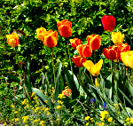
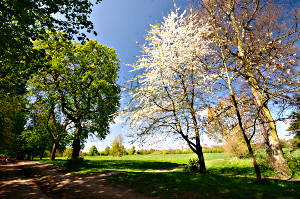
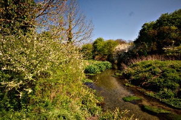
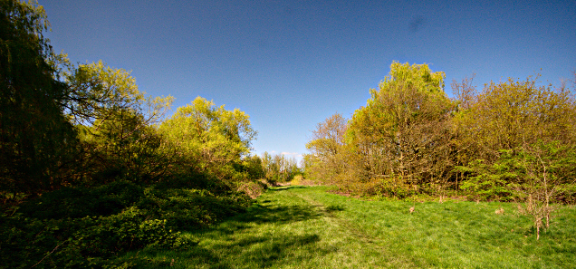
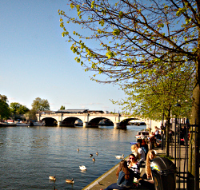

Walking the London LOOP - part 7 and 8
======================================

.. articleMetaData::
   :Where: London, UK
   :Date: 2014-04-17 09:29 Europe/London
   :Tags: blog, theloop, walking
   :Short: loop78

Section 7
---------

Another double whammy. We started out with a trek to Banstead. A trek, because
there are no trains to Banstead on Sundays. So tube to Elephant and Castle,
then trying to find the national rail station there—not an easy feat, then a
train to Epson and then finally a bus ride to Belmont, where we had to walk
over the Banstead Downs, and the golf course, to the start of section 7.

Section 7 is one of the shortest sections, at only 3½ miles. It starts by
crossing the golf club, and then continues through some posh streets. At the
time of year that we were there (April) there were lots of trees with blossom
and flowers, like tulips. Even though the streets are not busy, it would have
been better if we could go past another golf course, but apparently they're
been annoying and not granting access past their course.

After a while we walked through `Warren Farm`_, just before we got to `Nonsuch
Park`_. The latter is the last surviving part of the Little Park of Nonsuch, a
deer hunting park established by Henry VIII of England surrounding the former
Nonsuch Palace, of which there are some vague ruins to be seen. 

After coming through the park, we "ran into" the `Spring Tavern`_ in Ewell for
lunch and a pint.

.. _`Warren Farm`: https://www.woodlandtrust.org.uk/visiting-woods/wood/4660/warren-farm/
.. _`Nonsuch Park`: http://en.wikipedia.org/wiki/Nonsuch_Park
.. _`Spring Tavern`: http://www.springtavern.co.uk/home/

Section 8
---------

After lunch we came through `Bourne Hall Park`_ where section 7 ends and
section 8 starts. With 7 being so short, there was plenty of time to also
finish section 8. 

The start of section 8 is also the source of the Hogsmill_ river. And the
whole route of section 8 tries to follow the river as closely as possible. In
some places that was not really possible so we had some diversions through
residential areas, and slightly smellier, through the Hogsmill Valley Sewage
Treatment Works. But most of it, was pleasent walking past the river.

Near the end we came to Kingston-Upon-Thames were it was again a bit trickier
to follow the river.

With the weather being so nice, we *had* to stop for
a few pints at the end of the walk, at *two* of Kingston's river side pubs,
`the Bishop`_ and the Gazebo next door!

.. _`Bourne Hall Park`: http://www.epsom-ewell.gov.uk/EEBC/Leisure+and+Culture/Parks+and+countryside/Bourne+Hall+Ornamental+Garden.htm
.. _Hogsmill: http://en.wikipedia.org/wiki/Hogsmill_River
.. _`the Bishop`: http://www.thebishopkingston.co.uk/

The weather was again very good, with 16-18°C and no clouds to be seen. We took
just over four hours for the two sections that together were 20.3km
long.

The photos that I took on this section, as well as the photos of the
other sections of the LOOP, are available as a `Flickr set`_.

.. _LOOP: http://www.walklondon.org.uk/route.asp?R=5
.. _`Flickr set`: https://www.flickr.com/photos/derickrethans/sets/72157636982853053/with/13893364715
